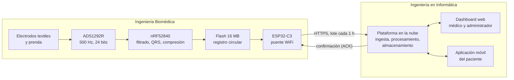
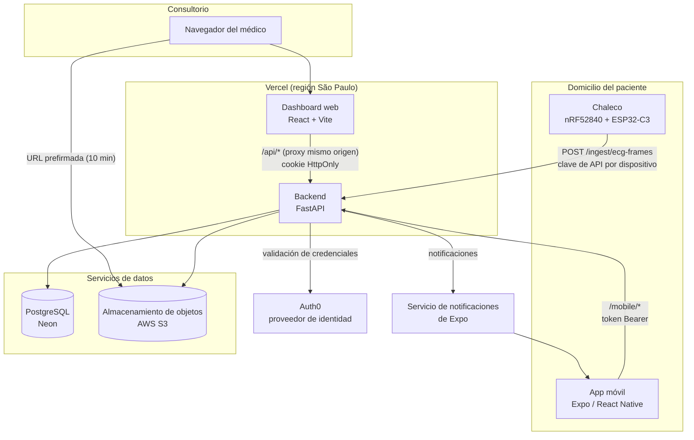
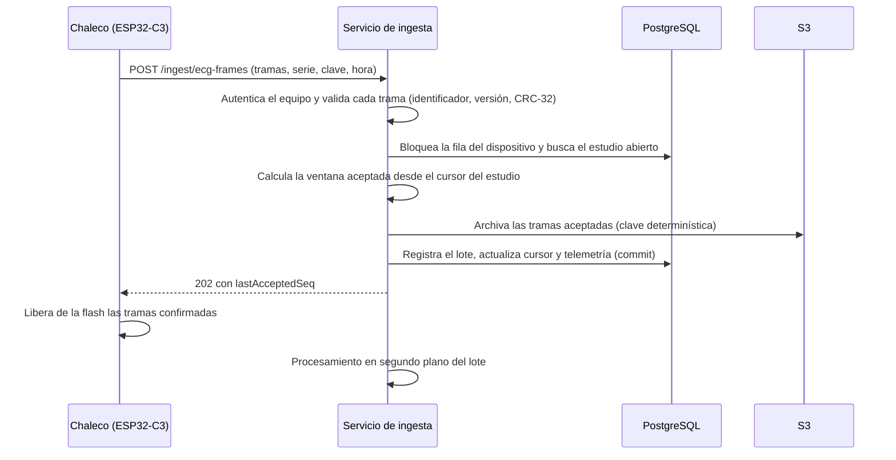
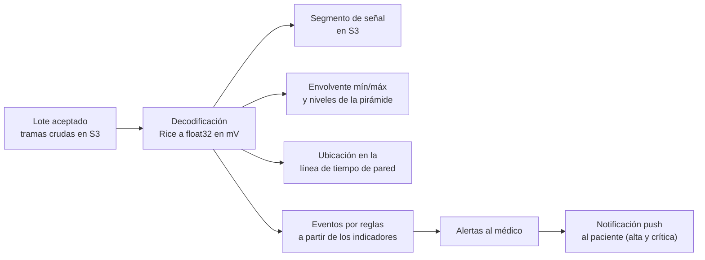
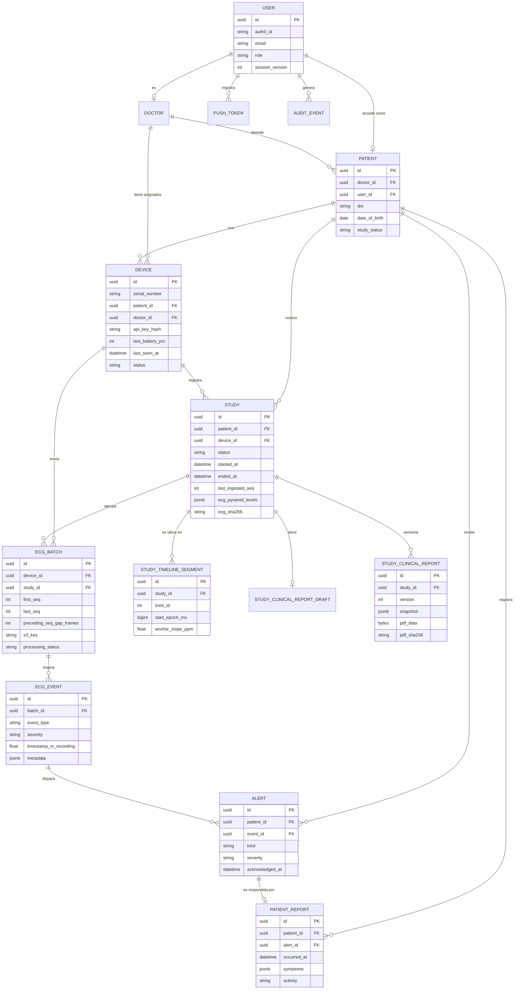
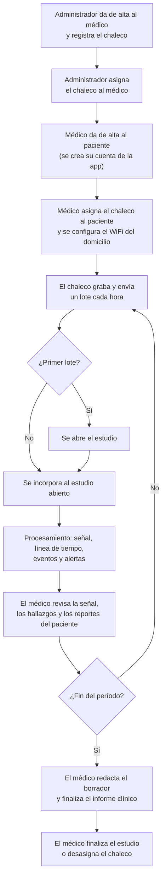
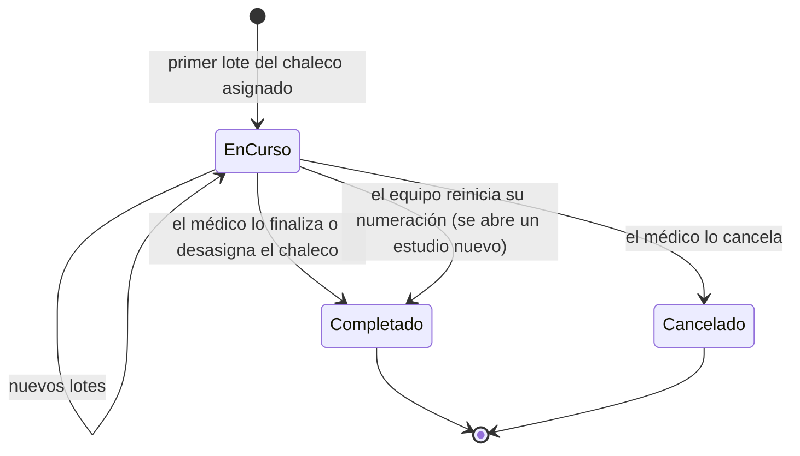
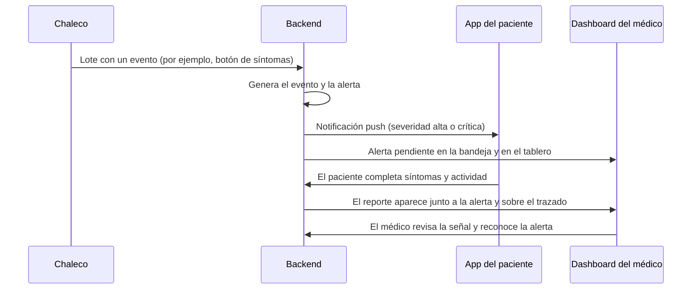

# Resumen Ejecutivo

Este trabajo desarrolló el sistema de software y gestión de datos de Holter Wearable ECG, un chaleco con electrodos textiles secos que registra de forma continua el electrocardiograma durante estudios de hasta dos semanas. El proyecto fue interdisciplinario: el equipo de Ingeniería Biomédica desarrolló el hardware y el firmware, y el equipo de Ingeniería en Informática desarrolló la plataforma en la nube, el dashboard web para médicos y la aplicación móvil del paciente.

El chaleco comprime la señal sin pérdida y la envía cada hora a través del WiFi del domicilio, sin depender del teléfono del paciente. Como su memoria local alcanza para unas cinco horas sin conexión, se definió con el equipo de Biomédica un protocolo en el que el equipo solo borra lo que el servidor guardó de forma durable. La plataforma valida y decodifica cada trama, ubica la señal en la hora real aun ante reinicios del equipo, genera eventos y alertas y la almacena en varios niveles de resolución para recorrer semanas de registro con fluidez. El dashboard ofrece un visor en las escalas estándar del papel de ECG y un informe clínico en PDF con versiones inmutables, y la aplicación móvil permite al paciente consultar el estado del chaleco, recibir notificaciones y registrar síntomas que el médico ve sobre el trazado.

El sistema se validó con 356 casos de prueba en el backend, pruebas en el dashboard y la aplicación, y pruebas con el equipo real en las que no se perdió ninguna trama ante veinte fallas del servidor. Estas pruebas también mostraron que la latencia de la plataforma serverless limita la capacidad de ingesta, un problema diagnosticado cuya solución se plantea como trabajo futuro. Los requerimientos se revisaron con cardiólogos electrofisiólogos, cuya devolución orientó el módulo de análisis automático de la señal con inteligencia artificial, actualmente en desarrollo. [COMPLETAR: resultados del módulo de inteligencia artificial.]

# 1. Introducción

El presente Trabajo de Grado forma parte de un proyecto interdisciplinario llevado a cabo en conjunto con alumnos de Ingeniería Biomédica de la Universidad Austral (Gonzalo Oxoby y Juan Bautista Buthet, bajo la dirección del Dr. Federico Bustos). El objetivo global del proyecto es diseñar y prototipar un sistema tipo Holter de uso prolongado, integrado en una prenda textil con electrodos secos, que registre de manera continua el electrocardiograma (ECG) del paciente y lo ponga a disposición del médico tratante sin que el paciente tenga que devolver el equipo para descargar los datos.

El hardware, el firmware del dispositivo y la prenda son responsabilidad del equipo de Ingeniería Biomédica. El objeto de este trabajo es el sistema de software y gestión de datos: la plataforma en la nube que recibe, valida, decodifica y almacena la señal; el dashboard web a través del cual el médico revisa los estudios y emite el informe clínico; y la aplicación móvil que acompaña al paciente durante el estudio. El trabajo de Ingeniería Biomédica se menciona solo en los puntos donde ambos sistemas se integran.

## 1.1. Motivación

Las enfermedades cardiovasculares son la principal causa de muerte en la Argentina. En 2023 representaron el 30,3 % de las defunciones del país, lo que equivale a aproximadamente 99.454 muertes en un año (Ministerio de Salud de la Nación, 2024). Una parte importante de estos eventos está precedida por alteraciones del ritmo cardíaco que pueden detectarse con un electrocardiograma, siempre que el registro coincida con el momento en que la alteración ocurre.

La herramienta habitual para registrar el ritmo cardíaco fuera del consultorio es el estudio Holter, que se utiliza durante 24 a 48 horas. Muchas arritmias son transitorias o asintomáticas y aparecen con una frecuencia menor a la que un registro de uno o dos días puede capturar. Kim et al. (2023) compararon un monitoreo continuo de siete días con un Holter de 24 horas en los mismos pacientes y obtuvieron una tasa de detección significativamente mayor con el registro prolongado, y Zimetbaum y Goldman (2010) señalan que para eventos poco frecuentes los registros de 24 a 48 horas resultan insuficientes.

Desde la perspectiva de la ingeniería informática, extender el monitoreo a dos semanas cambia la naturaleza del problema: un registro de dos semanas a 500 muestras por segundo supera los 600 millones de muestras por paciente, que deben viajar desde el domicilio hasta la nube, almacenarse sin pérdida, recorrerse con fluidez en el navegador del médico y resumirse en un informe. Un electrocardiograma de buena calidad que no llega al médico, o que llega incompleto, no tiene valor clínico.

## 1.2. Problemática

El estudio Holter convencional presenta tres limitaciones principales. La primera es su duración: el registro de 24 a 48 horas deja fuera de la ventana de observación a gran parte de los eventos esporádicos. La segunda es la comodidad: los electrodos adhesivos y los cables dificultan las actividades diarias, irritan la piel y reducen la adherencia del paciente, lo que impide extender el estudio. La tercera es la disponibilidad de los datos: la señal queda guardada en el equipo y el médico recién puede analizarla cuando el paciente lo devuelve.

En el otro extremo, los relojes inteligentes y las bandas deportivas son cómodos y se usan durante semanas, pero se basan mayormente en fotopletismografía o en registros de ECG puntuales iniciados por el usuario, sin la morfología continua ni la validación clínica necesarias para un diagnóstico electrofisiológico. Existe, por lo tanto, un espacio entre los equipos médicos tradicionales, precisos pero incómodos y de corta duración, y los wearables de consumo, cómodos pero insuficientes para el diagnóstico.

El proyecto aborda ese espacio con una prenda textil que registra el ECG de forma continua durante hasta dos semanas. Esta solución genera problemas propios del software, que son los que aborda este trabajo:

1. Transmisión confiable desde un dispositivo con recursos limitados: la memoria local de 16 MB alcanza para unas 5 horas sin conexión en el peor caso medido, por lo que una falla prolongada de la red o del servidor puede provocar pérdida de datos clínicos.
2. Volumen y continuidad de la señal: cientos de megabytes por estudio que deben decodificarse, ordenarse en el tiempo aunque el dispositivo se reinicie y almacenarse de modo que el médico navegue semanas de registro sin descargarlo completo.
3. Revisión clínica: el médico necesita ver la señal en las escalas estándar del papel de ECG, ubicar los eventos y los síntomas reportados y emitir un informe con valor documental.
4. Acompañamiento del paciente: durante dos semanas el paciente necesita saber si el equipo funciona y poder registrar lo que siente, sin conocimientos técnicos.
5. Seguridad y privacidad: los datos de salud están alcanzados por la Ley 25.326, por lo que el acceso debe estar autenticado, restringido y auditado.

## 1.3. Objetivo

### 1.3.1. Objetivo general

Desarrollar el sistema de software y gestión de datos de un dispositivo wearable tipo Holter ECG, compuesto por una plataforma en la nube, un dashboard web para el médico y una aplicación móvil para el paciente, que garantice la recepción confiable de la señal enviada por el dispositivo, su almacenamiento seguro y sin pérdida, y su disponibilidad para la revisión y el informe clínico durante estudios de hasta dos semanas.

### 1.3.2. Objetivos específicos

1. Definir, en conjunto con el equipo de Ingeniería Biomédica, el protocolo de comunicación entre el dispositivo y la nube, de modo que el dispositivo solo descarte los datos cuya recepción fue confirmada por el servidor. El cumplimiento se verifica con cero tramas perdidas en las pruebas con el dispositivo real ante fallos de envío.
2. Implementar un servicio de ingesta que valide la integridad de cada trama recibida, decodifique la señal comprimida sin pérdida y la almacene de forma idempotente frente a reenvíos. El cumplimiento se verifica con una decodificación idéntica a la del codificador de referencia y con el procesamiento completo de una hora de señal en las pruebas automatizadas.
3. Ubicar cada muestra de la señal en la hora real en que fue registrada, aun cuando el dispositivo se reinicie, con un error objetivo de ±1 segundo.
4. Desarrollar un dashboard web que permita al médico gestionar pacientes, dispositivos y estudios, visualizar la señal completa del estudio con las escalas clínicas estándar (25 y 50 mm/s; 5, 10 y 20 mm/mV) y generar un informe clínico en PDF con control de versiones.
5. Desarrollar una aplicación móvil de acompañamiento para Android e iOS que le permita al paciente consultar el estado del chaleco, recibir notificaciones y registrar síntomas. El cumplimiento se verifica cuando un reporte de síntomas enviado desde la aplicación, en respuesta a una notificación o de forma espontánea, aparece en el dashboard sobre el trazado en la hora correspondiente.
6. Proteger los datos de salud mediante autenticación, control de acceso por rol, cifrado en tránsito, registro de auditoría de los accesos a la señal y a los informes, y limitación de intentos de inicio de sesión.
7. Incorporar un módulo de detección de anomalías basado en inteligencia artificial que funcione como soporte a la decisión del médico. [COMPLETAR: métrica de cumplimiento una vez definido el modelo.]
8. Validar el sistema mediante pruebas automatizadas ejecutadas en integración continua, con una cobertura mínima del 65 % en el backend, y mediante pruebas de punta a punta con el hardware real del equipo de Ingeniería Biomédica.

## 1.4. Alcance

El trabajo abarca el diseño, la implementación, el despliegue y la validación del sistema de software. Dentro del alcance se incluyen:

1. El protocolo de comunicación entre el dispositivo y la nube, definido junto con el equipo de Ingeniería Biomédica: formato de las tramas, confirmación de recepción, reenvíos, sincronización horaria y diagnóstico del equipo.
2. El backend: API REST, ingesta y decodificación de la señal, almacenamiento en base de datos y en almacenamiento de objetos, generación de eventos y alertas, gestión de usuarios, pacientes, dispositivos y estudios, y almacenamiento versionado de los informes clínicos.
3. El dashboard web para médicos y administradores, incluido el visor de ECG y la generación del informe clínico en PDF.
4. La aplicación móvil de acompañamiento del paciente para Android e iOS.
5. Un simulador de chalecos integrado al dashboard, que reproduce el codificador del firmware y permite probar la plataforma sin depender del hardware.
6. La infraestructura de despliegue, la integración continua y la documentación técnica y operativa.
7. Las pruebas automatizadas y las pruebas de integración con el dispositivo real.
8. El módulo de análisis automático de la señal basado en inteligencia artificial, que comprende la clasificación de los segmentos del registro y el cálculo de las métricas clínicas del informe cardiológico, y que se encuentra en desarrollo al momento de redactar este documento.

Quedan fuera del alcance de este trabajo:

1. El diseño del hardware, la placa electrónica, los electrodos, la prenda textil y el firmware del microcontrolador y del coprocesador WiFi, que corresponden al equipo de Ingeniería Biomédica.
2. Los estudios de impedancia torácica, la prescripción digital del estudio con ventanas horarias, los umbrales de alerta configurables por paciente, la reclasificación manual de segmentos, las herramientas de medición manual sobre el trazado, la exportación en formatos clínicos como EDF+, el consentimiento informado digital y el esquema comercial de créditos de monitoreo. Estas funcionalidades surgieron del relevamiento de requerimientos, pero se priorizaron como trabajo futuro.
3. La certificación del dispositivo ante la ANMAT y los ensayos clínicos con pacientes patológicos.
4. El diagnóstico automático. El sistema se plantea como herramienta de soporte a la decisión y toda interpretación clínica queda a cargo del médico.

## 1.5. Valor ético y social

### 1.5.1. Principios generales de la ética: objeto y fin

El objeto del proyecto (el desarrollo de un dispositivo de monitoreo cardíaco continuo) y su fin (contribuir a la detección temprana de arritmias y patologías cardíacas, mejorando el diagnóstico y la calidad de vida de los pacientes) son éticamente legítimos y compatibles con los principios generales de la ética. El proyecto busca un bien objetivo: la salud de las personas, en un dominio donde el diagnóstico oportuno tiene impacto directo sobre la morbilidad y la mortalidad cardiovascular, principal causa de muerte en Argentina y en el mundo.

No se identifican circunstancias propias del diseño del proyecto que modifiquen negativamente la valoración ética de la acción. El dispositivo está orientado a un uso médico legítimo, prescrito por profesionales, y no presenta usos duales relevantes ni aplicaciones que puedan derivarse hacia fines moralmente cuestionables.

### 1.5.2. Impacto positivo, ético y social sobre los stakeholders

Pacientes. El sistema reduce la fricción del estudio Holter tradicional: la prenda textil con electrodos secos elimina la incomodidad de los electrodos adhesivos, mejora la adherencia al estudio prolongado y permite registros de mayor duración. Esto se traduce en mayor probabilidad de capturar eventos arrítmicos esporádicos que un Holter convencional de 24 horas puede no detectar.

Profesionales médicos. El dashboard centraliza los registros y facilita la revisión, reduciendo el tiempo entre la captura del evento y la decisión clínica. El envío automático de la señal cada hora a través del WiFi del domicilio elimina la dependencia de que el paciente retorne físicamente con el dispositivo para descargar los datos.

Sistema de salud. Al ser un dispositivo de bajo costo relativo, cuya operación no depende de un teléfono ni de una aplicación, favorece el acceso a poblaciones con menor alfabetización digital, lo que aporta a la equidad en el acceso a tecnología diagnóstica.

Bien común. El proyecto se inscribe en una línea de medicina preventiva y monitoreo remoto que contribuye a desplazar el sistema de salud desde un modelo reactivo hacia uno proactivo, en línea con el desarrollo humano integral que promueve el Ideario de la Universidad Austral.

### 1.5.3. Medidas para minimizar efectos negativos

El proyecto contempla mitigaciones específicas frente a los riesgos previsibles:

Privacidad y protección de datos de salud. Los registros de ECG son datos sensibles bajo la Ley 25.326 de Protección de Datos Personales. El backend cifra los datos en tránsito (TLS) y en reposo (cifrado del lado del servidor en S3), el acceso al dashboard requiere autenticación y se mantienen registros de auditoría de acceso. Se prevé una política de retención que permita al paciente solicitar la eliminación de sus datos.

Seguridad del paciente. El dispositivo es un coadyuvante diagnóstico, no un reemplazo del juicio médico. La documentación, la interfaz y el informe PDF aclaran que la interpretación del ECG y cualquier decisión clínica corresponden al profesional tratante. El sistema no emite diagnósticos automáticos, y las notificaciones que recibe el paciente son informativas y no vinculantes.

Cumplimiento regulatorio. Se sigue el marco de ANMAT para dispositivos médicos clase II y se documentan los procesos en línea con las exigencias regulatorias aplicables, aunque la certificación formal excede el alcance del Trabajo de Grado.

Confiabilidad técnica. La memoria flash del chaleco funciona como buffer de seguridad: si la red WiFi o el servidor fallan, los datos se acumulan localmente durante unas cinco horas en el peor caso medido y el equipo solo borra lo que el servidor confirmó haber guardado, evitando la pérdida silenciosa de información clínica.

Sustentabilidad. El uso de un coprocesador WiFi que permanece apagado entre envíos y una batería Li-Po de 1800 mAh permite una autonomía de unos diez días, reduciendo la frecuencia de recarga y el impacto ambiental asociado al ciclo de vida de la batería.

### 1.5.4. Compatibilidad con los derechos humanos

El proyecto es compatible con los derechos humanos fundamentales, en particular con el derecho a la salud (art. 25 de la Declaración Universal). No se identifican aspectos que puedan vulnerar derechos de los pacientes ni de terceros:

Consentimiento informado. El uso del dispositivo está mediado por la prescripción médica y supone el consentimiento explícito del paciente respecto al tratamiento de sus datos.

No discriminación. El diseño no presupone capacidades técnicas particulares del paciente: la operación del chaleco es autónoma y no requiere smartphone, y la aplicación móvil es un complemento diseñado para adultos mayores, lo que favorece el acceso de personas con menor alfabetización digital.

Equidad. El público objetivo (pacientes de 40 a 70 años en Argentina) está deliberadamente orientado a un segmento donde la prevalencia de patologías cardiovasculares es alta y donde el costo y la accesibilidad del estudio Holter convencional pueden ser una barrera.

Dignidad. La prenda textil con electrodos secos preserva la comodidad y la dignidad del paciente durante el monitoreo prolongado, evitando irritaciones y la estigmatización visible asociada al cableado de equipos médicos tradicionales.

### 1.5.5. Integridad académica

El trabajo se desarrolla bajo estándares de integridad académica. Todas las fuentes consultadas (bibliografía técnica, normativa regulatoria, hojas de datos de componentes, publicaciones científicas sobre ECG y monitoreo cardíaco) se citan en formato APA en la sección Bibliografía de este documento. El código fuente, los esquemáticos y la documentación técnica son producción original del equipo; cuando se utilizan librerías de código abierto, frameworks o componentes de terceros (FastAPI, React, shadcn/ui, Radix, etc.) se respetan sus licencias y se atribuye su autoría. No se incurre en fraude, plagio ni en presentación de resultados no verificables.

### 1.5.6. Discernimiento ético

Tras la autoevaluación realizada, no se identifican aspectos éticos del proyecto que puedan resultar cuestionables y que requieran un informe de discernimiento ético específico.

El proyecto presenta un objeto (un dispositivo médico de monitoreo) y un fin (la detección temprana de patologías cardíacas) éticamente legítimos. Los riesgos previsibles (privacidad de datos de salud, seguridad del paciente, cumplimiento regulatorio) son riesgos generales asociados a cualquier dispositivo médico conectado, y el proyecto incorpora mitigaciones explícitas para cada uno de ellos (cifrado, autenticación, marco regulatorio ANMAT, Ley 25.326, función coadyuvante al juicio médico). No se trata de aspectos éticamente controvertidos que admitan posturas razonadas en conflicto, sino de buenas prácticas técnicas y regulatorias estándar en la industria de dispositivos médicos.

El proyecto no involucra experimentación en humanos fuera de un marco clínico controlado, uso dual con aplicaciones militares o de vigilancia, manipulación de información que pudiera afectar la autonomía del paciente, ni decisiones automatizadas con impacto clínico sin intervención profesional. Por estas razones, se considera que la presente autoevaluación es suficiente y no corresponde elaborar un Informe de Discernimiento Ético adicional.

En conclusión, el proyecto es compatible con el Ideario de la Universidad Austral en tanto contribuye al bien común mediante el desarrollo de tecnología que mejora la salud y la calidad de vida de las personas, promueve el acceso equitativo a herramientas de diagnóstico, respeta la dignidad del paciente y se desarrolla bajo estándares de integridad académica y profesional.

### 1.5.7. Viabilidad legal y regulatoria

Por tratarse de un sistema que registra y transmite información de salud, el proyecto se encuadra en tres marcos normativos.

En primer lugar, un equipo de monitoreo electrocardiográfico ambulatorio es un producto médico y su comercialización en la Argentina requiere el registro ante la Administración Nacional de Medicamentos, Alimentos y Tecnología Médica (ANMAT), conforme al Reglamento Técnico Mercosur de Registro de Productos Médicos (ANMAT, 2002). Por su nivel de riesgo, se prevé su clasificación como producto de clase II. El registro exige documentar en el expediente técnico el protocolo de comunicación, el mecanismo de configuración del equipo y el flujo de datos, por lo que estas decisiones se documentaron durante el desarrollo.

En segundo lugar, los registros de ECG, los síntomas reportados y los datos identificatorios del paciente son datos sensibles según la Ley 25.326 de Protección de los Datos Personales (Ley 25.326, 2000), que obliga a contar con el consentimiento del titular y a aplicar medidas de seguridad que garanticen la confidencialidad; las medidas técnicas adoptadas se detallan en la sección 5.5. Como el chaleco usa la red WiFi del domicilio, la contraseña de esa red también es un dato personal: se guarda en el dispositivo solo durante el estudio y debe borrarse al devolverlo. El consentimiento informado debe aclarar este uso, junto con el consumo de datos de la conexión del domicilio.

En tercer lugar, el informe clínico forma parte de la documentación de la atención del paciente, alcanzada por la Ley 26.529 de Derechos del Paciente (Ley 26.529, 2009), que exige su integridad e inalterabilidad. Por ese motivo, los informes finalizados se almacenan como versiones inmutables, con un resumen criptográfico que permite verificar que no fueron modificados.

# 2. Marco Teórico

Esta sección presenta los conceptos necesarios para comprender el trabajo: la señal que se registra y el estudio clínico en el que se utiliza, los dispositivos wearables y la Internet de las Cosas en salud, las técnicas de compresión y transmisión confiable de señales y los servicios en la nube empleados. Cierra con el estado del arte de las soluciones de monitoreo cardíaco ambulatorio.

## 2.1. El electrocardiograma y el estudio Holter

El electrocardiograma es el registro, en función del tiempo, de la actividad eléctrica del corazón medida mediante electrodos ubicados sobre la piel. Cada ciclo cardíaco produce una secuencia característica de ondas: la onda P, asociada a la despolarización de las aurículas; el complejo QRS, asociado a la despolarización de los ventrículos; y la onda T, que corresponde a su repolarización. La forma de esas ondas, su duración y los intervalos entre ellas permiten identificar alteraciones del ritmo y de la conducción. Cada combinación de electrodos que se mide se denomina derivación.

La presentación del electrocardiograma está estandarizada. El registro convencional utiliza una velocidad de barrido de 25 mm/s y una ganancia de 10 mm/mV, sobre una cuadrícula en la que cada cuadro pequeño de 1 mm equivale a 40 ms y 0,1 mV, y cada cuadro grande de 5 mm a 200 ms y 0,5 mV (Kligfield et al., 2007). Las variantes de 50 mm/s y de 5 o 20 mm/mV se usan para ampliar o reducir el trazado. Buena parte de las mediciones clínicas, como la duración del QRS o los intervalos PR y QT, se realizan contando cuadros, por lo que la fidelidad de la escala es un requisito de cualquier sistema de visualización.

Las arritmias son alteraciones de la frecuencia o de la regularidad del ritmo cardíaco, como la fibrilación auricular, las extrasístoles, las taquicardias, las bradicardias y las pausas. Muchas son paroxísticas, es decir, aparecen de forma intermitente, y pueden no producir síntomas.

El monitoreo electrocardiográfico ambulatorio fue introducido por Holter (1961). El estudio que hoy lleva su nombre registra de manera continua entre dos y doce derivaciones durante 24 a 48 horas mediante electrodos adhesivos conectados por cables a un grabador portátil, que el paciente devuelve al terminar para su análisis. Existen además monitores de eventos, parches adhesivos de uso prolongado, dispositivos de telemetría móvil y monitores implantables. La elección depende de la frecuencia esperada de los síntomas: cuanto menos frecuente es el evento, mayor debe ser la duración del monitoreo (Zimetbaum y Goldman, 2010).

## 2.2. Dispositivos wearables e Internet de las Cosas en salud

La Internet de las Cosas (IoT, por sus siglas en inglés) designa el conjunto de objetos físicos con capacidad de medir, procesar y comunicar datos a través de una red. Su aplicación al cuidado de la salud permite el monitoreo remoto de pacientes fuera del ámbito hospitalario y suele organizarse en tres capas: la capa de percepción, formada por los sensores con recursos limitados de energía, memoria y procesamiento; la capa de red, que transporta los datos; y la capa de aplicación, que los almacena, procesa y presenta a los usuarios (Islam et al., 2015).

Los dispositivos wearables son equipos que el usuario lleva puestos durante sus actividades diarias. En el caso del electrocardiograma, el componente que más influye en la calidad de la señal y en la comodidad es el electrodo. Los electrodos de plata y cloruro de plata con gel ofrecen una baja impedancia de contacto, pero irritan la piel y pierden eficacia a medida que el gel se seca. Los electrodos textiles secos son reutilizables y más cómodos, a cambio de una mayor impedancia y de una mayor sensibilidad a los artefactos de movimiento y al desplazamiento de la prenda (Nigusse et al., 2021).

Las tecnologías de conectividad más utilizadas en wearables son Bluetooth de baja energía (BLE), de bajo consumo pero dependiente de un teléfono o pasarela cercana; WiFi, de mayor consumo instantáneo pero con acceso directo a internet; y las redes celulares para IoT, como LTE-M, con cobertura fuera del domicilio a cambio de un módulo más costoso y un plan de datos.

## 2.3. Adquisición, compresión y transmisión de señales biomédicas

La adquisición digital de una señal biomédica consiste en muestrearla a una frecuencia fija y cuantizar cada muestra con una resolución determinada. En el ECG se utilizan frecuencias de algunos cientos de muestras por segundo y convertidores de 16 a 24 bits. Los circuitos integrados de frontal analógico (AFE) para biopotenciales reúnen en un solo componente la amplificación, el filtrado y la conversión analógica a digital.

Un registro continuo de varios días requiere compresión, y en aplicaciones clínicas se prefiere la compresión sin pérdida, que permite reconstruir exactamente la señal original. Un esquema habitual combina dos etapas. La primera es la predicción: cada muestra se estima a partir de las anteriores y solo se guarda la diferencia, llamada residuo, que en una señal que cambia de forma gradual suele ser pequeña. La segunda es la codificación entrópica de los residuos, que asigna menos bits a los valores más frecuentes. Los códigos de Golomb (Golomb, 1966) y su caso particular, los códigos de Rice (Rice, 1979), son eficientes para residuos con distribución aproximadamente geométrica y sencillos de implementar en microcontroladores. El desempeño de estos algoritmos suele evaluarse sobre bases públicas como la MIT-BIH Arrhythmia Database (Moody y Mark, 2001).

La transmisión confiable a través de una red que puede perder o demorar mensajes se resuelve mediante protocolos de repetición automática: el emisor numera cada unidad de datos y el receptor confirma lo que recibió. En la variante Go-Back-N, el emisor puede enviar varias unidades sin esperar confirmación, dentro de una ventana; el receptor confirma de forma acumulativa la última unidad recibida en orden, y ante la falta de confirmación el emisor retransmite desde la unidad más antigua no confirmada (Kurose y Ross, 2021). Los datos corrompidos se detectan con códigos como el CRC (verificación de redundancia cíclica). Como una retransmisión puede hacer que el receptor reciba dos veces la misma unidad, el procesamiento debe ser idempotente, es decir, producir el mismo resultado sin importar cuántas veces llegue.

Por último, los dispositivos sin reloj de tiempo real solo conocen el tiempo transcurrido desde su encendido, por lo que la hora de pared debe reconstruirse a partir de una referencia externa, como el protocolo NTP (Mills et al., 2010). Los osciladores presentan además una deriva, expresada en partes por millón (ppm), que acumula error en registros prolongados.

## 2.4. Servicios en la nube para datos clínicos

El estilo arquitectónico REST organiza un sistema distribuido en recursos identificados por direcciones, sobre los que se opera mediante los métodos estándar de HTTP y con interacciones sin estado (Fielding, 2000). Es el estilo predominante para las API que consumen aplicaciones web, móviles y dispositivos.

La computación sin servidor (serverless) es un modelo en el que el proveedor administra la infraestructura y ejecuta el código en respuesta a cada solicitud, escalando de forma automática y cobrando por el uso efectivo. Entre sus limitaciones se encuentran el arranque en frío, es decir, la demora adicional cuando una solicitud llega y no hay una instancia activa, y los límites de duración de cada invocación (Jonas et al., 2019).

Las bases de datos relacionales guardan información estructurada con garantías de integridad y transacciones. El almacenamiento de objetos guarda archivos de gran tamaño de forma durable y económica, y permite entregarlos al cliente mediante URLs prefirmadas: direcciones temporales, firmadas por el servidor, que autorizan la descarga de un objeto durante un período acotado sin exponer las credenciales.

OAuth 2.0 es el marco estándar para delegar la autorización del acceso a recursos protegidos (Hardt, 2012), y los JSON Web Tokens (JWT) son un formato compacto y firmado para transportar la identidad y los permisos de un usuario (Jones et al., 2015). El control de acceso basado en roles asigna permisos a roles, como médico o administrador, en lugar de a cada usuario (Sandhu et al., 1996).

## 2.5. Inteligencia artificial aplicada al análisis de ECG

## 2.6. Estado del arte

### 2.6.1. Soluciones existentes

Las soluciones actuales de monitoreo cardíaco ambulatorio pueden agruparse en cuatro categorías: el Holter convencional, los parches adhesivos de uso prolongado, las prendas textiles con electrodos integrados y los dispositivos de consumo. El Holter convencional es el estándar de la práctica clínica, con las limitaciones descriptas en la sección 1.2.

Entre los parches adhesivos, el más difundido es el Zio de iRhythm, de una derivación, que registra de forma continua hasta 14 días. En un estudio en el que 146 pacientes usaron al mismo tiempo un Holter de 24 horas y el parche, este último detectó más eventos arrítmicos y fue preferido por la mayoría de los pacientes (Barrett et al., 2014). En la versión XT el registro se analiza una vez devuelto el parche; la versión AT agrega transmisión durante el estudio.

Entre las prendas textiles se destaca Nuubo, que integra electrodos textiles en una prenda con un grabador desmontable y se utilizó para monitorear durante 28 días a pacientes con accidente cerebrovascular de causa desconocida (Pagola et al., 2018). Hexoskin, por su parte, es una camiseta con sensores de ECG, respiración y actividad orientada al deporte y a la investigación (Khundaqji et al., 2020).

Entre los dispositivos de consumo, el Apple Watch combina la detección de pulso irregular por fotopletismografía con un ECG de una derivación de unos 30 segundos iniciado por el usuario. En el Apple Heart Study, con más de 400.000 participantes, la notificación de pulso irregular mostró un valor predictivo positivo del 84 % respecto de la fibrilación auricular (Perez et al., 2019), pero estos registros son puntuales y no reemplazan un monitoreo continuo.

La Tabla 1 resume las características de estas soluciones y las compara con la propuesta de este proyecto.

Tabla 1. Comparación de soluciones de monitoreo cardíaco ambulatorio

| Característica | Holter convencional | Parche Zio XT | Prenda Nuubo | Hexoskin | Apple Watch | Holter Wearable ECG |
|---|---|---|---|---|---|---|
| Formato | Grabador con cables y electrodos adhesivos | Parche adhesivo | Prenda textil y grabador | Camiseta textil | Reloj | Chaleco textil con electrodos secos |
| Duración típica | 24 a 48 h | Hasta 14 días | Semanas | Uso diario | Uso diario | Hasta 2 semanas |
| Registro continuo del ECG | Sí | Sí | Sí | Sí | No, registros de 30 s | Sí |
| Adhesivos sobre la piel | Sí | Sí | No | No | No | No |
| Acceso del médico durante el estudio | No | No (sí en la versión AT) | [VERIFICAR] | Mediante plataforma propia | Registros enviados por el usuario | Sí, envío automático cada hora |
| Depende de un teléfono | No | No | [VERIFICAR] | Sí | Sí | No |
| Aplicación de acompañamiento del paciente | No | No | [VERIFICAR] | Sí | Sí | Sí, con registro de síntomas sobre el trazado |
| Orientación | Clínica | Clínica | Clínica | Deporte e investigación | Consumo | Clínica |

Fuente: elaboración propia a partir de Barrett et al. (2014), Pagola et al. (2018), Khundaqji et al. (2020) y Perez et al. (2019).

### 2.6.2. Análisis FODA

La Tabla 2 presenta el análisis de fortalezas, oportunidades, debilidades y amenazas (FODA) de la propuesta (Gürel y Tat, 2017), considerando el sistema completo y, en particular, el componente de software desarrollado en este trabajo.

Tabla 2. Análisis FODA del sistema Holter Wearable ECG

| | Aspectos positivos | Aspectos negativos |
|---|---|---|
| Origen interno | Fortalezas: registro continuo de hasta dos semanas sin adhesivos; envío automático de la señal sin depender del teléfono del paciente; acceso del médico durante el estudio; protocolo que no admite pérdida silenciosa de datos; síntomas del paciente vinculados al trazado; componentes de hardware de bajo costo y disponibles comercialmente. | Debilidades: una sola derivación en el prototipo; memoria local de 16 MB que obliga a sincronizar con frecuencia; dependencia del WiFi del domicilio; latencia de respuesta del backend en la infraestructura actual; análisis automático de arritmias todavía en desarrollo. |
| Origen externo | Oportunidades: creciente adopción del monitoreo remoto; alta prevalencia de enfermedades cardiovasculares en el país; posibilidad de colaboración con el Hospital Universitario Austral para validaciones futuras; avance de los modelos de inteligencia artificial para el análisis de ECG. | Amenazas: competidores internacionales con validación clínica y regulatoria ya obtenida; exigencias del registro ante la ANMAT; costos de importación de componentes; resistencia al cambio frente a un estudio establecido como el Holter. |

Fuente: elaboración propia.

### 2.6.3. Conclusión del estado del arte

El relevamiento muestra que el problema de extender la duración del monitoreo ya fue abordado por los parches adhesivos y por algunas prendas textiles, y que la evidencia confirma que un registro más largo detecta más arritmias que el Holter de 24 horas. Sin embargo, las soluciones clínicas disponibles no suelen combinar en un mismo sistema una prenda sin adhesivos, la transmisión automática de la señal durante el estudio sin depender de un teléfono y un canal de comunicación con el paciente para registrar lo que siente. Los dispositivos de consumo, por su parte, no ofrecen un registro continuo apto para el diagnóstico. Además, las soluciones relevadas son desarrollos del exterior, con costos de adquisición y de servicio pensados para otros mercados.

El aporte de este proyecto consiste en integrar esas características en un sistema de desarrollo local, con hardware de bajo costo y una plataforma de software diseñada para que la señal llegue completa al médico mientras el estudio está en curso. Su relevancia social está dada por el peso de las enfermedades cardiovasculares en la mortalidad del país y por la posibilidad de detectar de forma más temprana arritmias que hoy pasan inadvertidas por la corta duración de los estudios convencionales.

# 3. La aplicación

## 3.1. Descripción general del sistema

Holter Wearable ECG es un sistema de monitoreo electrocardiográfico continuo para estudios de hasta dos semanas que aplica dos tendencias actuales de la informática: la Internet de las Cosas, con un dispositivo que transmite de forma autónoma a la nube, y la computación en la nube serverless. Está formado por cuatro componentes, que se muestran en la Figura 1.

El primer componente es el chaleco, desarrollado por el equipo de Ingeniería Biomédica: una prenda con tres electrodos textiles secos que registran una derivación de ECG. La electrónica se basa en un microcontrolador Seeed XIAO nRF52840 y en un frontal analógico Texas Instruments ADS1292R que muestrea la señal a 500 Hz con 24 bits. El firmware comprime la señal sin pérdida en tramas de 256 bytes y la guarda en una memoria flash de 16 MB organizada como registro circular. Como el nRF52840 no tiene WiFi, un coprocesador ESP32-C3 se enciende una vez por hora, se conecta a la red del domicilio y envía las tramas acumuladas. El equipo se alimenta con una batería de 1800 mAh, con una autonomía estimada de unos diez días, y la red WiFi se configura una sola vez, al entregar el chaleco, mediante un portal web que el propio equipo ofrece.

Los otros tres componentes se desarrollaron en este trabajo. La plataforma en la nube recibe las tramas, verifica su integridad, confirma su recepción, decodifica la señal, la ubica en la hora real, la almacena y genera los eventos y alertas. El dashboard web permite a los médicos gestionar pacientes y chalecos, revisar la señal y emitir el informe clínico, y a los administradores gestionar usuarios y equipos. La aplicación móvil permite al paciente consultar el estado del chaleco, recibir notificaciones y registrar síntomas; no forma parte del camino de los datos, por lo que el chaleco funciona aunque el paciente no tenga teléfono.

Figura 1. Componentes del sistema Holter Wearable ECG y responsabilidad de cada equipo.
Fuente: elaboración propia.

La frontera entre los dos equipos está definida por un contrato de comunicación: el firmware es responsable de todo lo que ocurre hasta la recepción de la confirmación del servidor, y la plataforma de todo lo que ocurre desde la recepción. La regla central es que confirmar significa que los datos ya están guardados de forma durable, y que el dispositivo solo borra lo que el servidor confirmó. El aporte del equipo de Informática en la parte del dispositivo consistió en definir ese contrato, portar el decodificador de la señal a Python y a TypeScript, construir un simulador de chalecos y conducir las pruebas de integración.

## 3.2. Evolución respecto del plan de trabajo

Durante el desarrollo, varias decisiones del plan de trabajo cambiaron a partir de mediciones sobre el hardware real, de restricciones de costo y de la disponibilidad de componentes. La Tabla 3 resume los cambios y sus motivos.

Tabla 3. Cambios respecto del plan de trabajo y motivos

| Aspecto | Plan de trabajo | Estado actual | Motivo |
|---|---|---|---|
| Canal de comunicación | Módulo celular LTE-M con tarjeta SIM | WiFi del domicilio mediante un coprocesador ESP32-C3 | Decisión conjunta de ambos equipos por costo (módulo SIM y plan de datos mensual, innecesarios para las pruebas del producto) y por consumo, mayor que el del módulo WiFi. |
| Microcontrolador | XIAO nRF52840 | XIAO nRF52840 con coprocesador WiFi | Migrar a un microcontrolador con WiFi integrado reducía la autonomía a unos 4,8 días y obligaba a descartar el firmware ya validado. |
| Almacenamiento local | Tarjeta microSD | Memoria flash SPI de 16 MB | No se consiguió una memoria de mayor capacidad y 16 MB alcanzan para el prototipo. Para el producto se prevé una microSD de mayor capacidad. |
| Canales de ECG | Tres canales | Una derivación | El equipo de Biomédica priorizó obtener una derivación de buena calidad con electrodos secos para simplificar el prototipo. |
| Compresión | Codificación delta | Predictor de orden 2 y códigos de Rice, sin pérdida | Implementada y medida por el firmware: relación de 12,8 veces sobre ruido ambulatorio de referencia. |
| Batería | 500 a 800 mAh, 2 a 3 días | 1800 mAh, unos 10 días | Batería seleccionada por el equipo de Biomédica. |
| Participación en el firmware | Desarrollo conjunto | Contrato de comunicación, decodificador, simulador e integración | El firmware completo quedó a cargo de Biomédica y el equipo de Informática se concentró en la interfaz entre ambos sistemas. |
| Aplicación móvil | A evaluar | Aplicación de acompañamiento del paciente | Surgió del relevamiento con médicos: registro de síntomas asociado a las alertas, notificaciones y estado del chaleco. No transporta datos de la señal. |
| Bluetooth | Parte de la arquitectura evaluada | Eliminado del firmware | Dejó de tener uso al adoptarse WiFi como canal único. |
| Frecuencia de envío | Cada 1 hora | Cada 1 hora | Sin cambios. Durante las pruebas de integración se configuró un envío cada 10 minutos. |

Fuente: elaboración propia.

La consecuencia más importante para el software es la capacidad del buffer local. Con la memoria de 16 MB, el equipo de Biomédica midió sobre la placa real una autonomía sin conexión de 5,1 horas con el chaleco flojo, 7,1 horas con electrodos de gel y 8,6 horas con el chaleco bien colocado: cuanto peor es el contacto, más ruido entra en la señal y peor se comprime. El sistema se dimensionó contra el peor caso de 5,1 horas, por lo que el envío periódico forma parte del proceso de grabación y la plataforma no puede ser el cuello de botella.

## 3.3. Metodología y planificación

El proyecto se gestionó con una metodología ágil basada en Kanban (Anderson, 2010), apoyada en los principios del manifiesto ágil de entregas frecuentes y adaptación al cambio (Beck et al., 2001). Se eligió un flujo continuo en lugar de iteraciones de duración fija porque buena parte del trabajo dependía de los avances del equipo de Biomédica, cuyos tiempos no podían planificarse con precisión, y porque varios requerimientos cambiaron a partir de mediciones sobre el hardware.

Las tareas se registraron como incidencias en Linear, con el prefijo TES, en un tablero con columnas de pendientes, en curso, en revisión y terminadas. Cada tarea se desarrolló en una rama propia y se incorporó a la rama principal mediante una solicitud de integración (pull request) en GitHub, con revisión de código asistida por un revisor automático y la integración continua descripta en la sección 6.3 como condición para integrar el cambio. Entre el 20 de mayo y el 20 de septiembre de 2026 se integraron 42 solicitudes.

El trabajo se dividió según los perfiles de los integrantes: Tomás Serra se ocupó del frontend (dashboard web, diseño de la interfaz y aplicación móvil) y Martín Barreiro del backend y la base de datos. Las decisiones de arquitectura se tomaron en conjunto y se documentaron como registros de decisiones de arquitectura (ADR), un formato breve que describe el contexto, la decisión y sus consecuencias (Nygard, 2011).

La coordinación con el equipo de Ingeniería Biomédica se realizó mediante reuniones periódicas y documentos de integración compartidos, descriptos en la sección 11.8.

La carga horaria planificada fue de 8 horas semanales por integrante durante 25 semanas, es decir, 200 horas por integrante y 400 horas para el equipo. La Tabla 4 muestra el cronograma planificado, registrado en una herramienta de diagramas de Gantt en línea.

Tabla 4. Cronograma planificado del proyecto

| Fase | Descripción | Inicio | Fin |
|---|---|---|---|
| 1 | Investigación y definición de requisitos | 01/04/2026 | 15/05/2026 |
| 2 | Definición del contrato de comunicación con el firmware | 18/05/2026 | 01/06/2026 |
| 3 | Desarrollo del backend y del dashboard médico en paralelo | 02/06/2026 | 03/08/2026 |
| 4 | Integración entre el firmware y la nube | 04/08/2026 | 25/08/2026 |
| 5 | Integración con el hardware del equipo biomédico | 26/08/2026 | 16/09/2026 |
| 6 | Detección de anomalías con inteligencia artificial | 17/09/2026 | 30/10/2026 |
| 7 | Pruebas y validación del sistema, seguridad y aspectos regulatorios | 02/11/2026 | 09/11/2026 |
| 8 | Documentación y redacción del informe final | 10/11/2026 | 01/12/2026 |

Fuente: elaboración propia.

[COMPLETAR: cronograma real ejecutado, con la comparación respecto del planificado y la explicación de los desvíos.]

## 3.4. Modelo de negocio

[COMPLETAR: modelo de negocio que muestre cómo el producto se vuelve sustentable y rentable en el tiempo. Puede presentarse con un Business Model Canvas: segmentos de clientes (clínicas, centros de cardiología, hospitales, ensayos clínicos), propuesta de valor, canales, fuentes de ingresos y estructura de costos.]

### 3.4.1. Propuesta de valor y modelo de ingresos

[COMPLETAR: propuesta de valor por actor y esquema de ingresos. El relevamiento de requerimientos menciona un modelo de créditos de monitoreo por cuenta médica (tiempo de uso o cantidad de estudios), que puede servir como punto de partida.]

### 3.4.2. Viabilidad económico financiera

[COMPLETAR: análisis de al menos dos escenarios (optimista y pesimista) con al menos una herramienta de análisis financiero, como VAN, TIR, período de recupero o punto de equilibrio. Incluir los costos de infraestructura en la nube por estudio.]

### 3.4.3. Viabilidad técnica del hardware

El hardware del prototipo se construyó con componentes disponibles comercialmente: el módulo Seeed XIAO nRF52840, el frontal analógico ADS1292R de Texas Instruments, una memoria flash SPI de 16 MB, el módulo ESP32-C3 y una batería de polímero de litio de 1800 mAh. La elección del canal WiFi agrega entre USD 2,60 y 3,10 por unidad por el coprocesador, frente a USD 10,70 a 13,20 del módulo celular que se había previsto originalmente, y no genera costos de conectividad recurrentes, porque usa la conexión del domicilio del paciente. Para el producto se prevé reemplazar la memoria flash por una microSD de mayor capacidad y dejar previsto en la placa el espacio para un módulo celular, de modo que una futura variante para pacientes sin WiFi no exija rediseñar la arquitectura.

[COMPLETAR: costo total de componentes por unidad (lista de materiales), costo de la prenda y análisis de la posibilidad de fabricación o compra en escala.]

# 4. Tecnologías

La elección de las tecnologías se guió por cuatro criterios: la confiabilidad frente a la pérdida de datos, el tipado estático de punta a punta para reducir errores entre componentes, la productividad de un equipo de dos personas y el costo de operación. La Tabla 5 resume las tecnologías utilizadas y los apartados siguientes justifican su elección.

Tabla 5. Tecnologías utilizadas por componente

| Componente | Tecnologías |
|---|---|
| Dispositivo (Biomédica) | Seeed XIAO nRF52840, Texas Instruments ADS1292R, flash SPI S25FL128L de 16 MB, ESP32-C3 |
| Backend | Python 3.12, FastAPI, Pydantic 2, SQLAlchemy 2 asíncrono, asyncpg, Alembic, NumPy, boto3, structlog |
| Base de datos y almacenamiento | PostgreSQL 16 (Neon en producción), AWS S3 (MinIO en desarrollo) |
| Dashboard web | React 19, TypeScript, Vite, Tailwind CSS 4, shadcn/ui y Radix, TanStack Query, React Router 7, React Hook Form y Zod, uPlot, Recharts, jsPDF |
| Aplicación móvil | Expo SDK 57, React Native 0.86, Expo Router, NativeWind, TanStack Query, Expo Notifications, Expo Secure Store |
| Autenticación | Auth0, JWT propio, claves de API por dispositivo |
| Infraestructura | Vercel, Docker Compose, GitHub Actions, EAS (Expo Application Services) |
| Calidad | pytest, Vitest, Ruff, mypy, ESLint, Prettier, Husky, Bandit, pip-audit, npm audit, TruffleHog |

Fuente: elaboración propia.

## 4.1. Dispositivo y canal de comunicación

El hardware del chaleco, descripto en la sección 3.1, fue seleccionado por el equipo de Biomédica: el XIAO nRF52840 se basa en un procesador Cortex-M4F de bajo consumo (Nordic Semiconductor, s.f.) y el ADS1292R es un frontal analógico de 24 bits para biopotenciales (Texas Instruments, s.f.). Sobre esa base, el firmware validó su detector de complejos QRS contra la MIT-BIH Arrhythmia Database con una sensibilidad del 99,28 % y un valor predictivo positivo del 99,73 %.

La decisión de mayor impacto para el software fue la elección del canal de comunicación. Se compararon cuatro alternativas con cálculos de consumo y costo sobre la base de un consumo del equipo sin radio de unos 6 mA y una capacidad útil de batería de 1530 mAh. La Tabla 6 resume la comparación.

Tabla 6. Comparación de canales de transmisión

| Alternativa | Autonomía estimada | Hardware adicional por unidad | Costo recurrente | Dependencia del paciente |
|---|---|---|---|---|
| BLE con aplicación en el teléfono | 10,0 días | Ninguno | Ninguno | Teléfono y aplicación activos todos los días |
| WiFi con coprocesador ESP32-C3 | 10,2 días | USD 2,60 a 3,10 | Ninguno (usa el WiFi del domicilio) | Red WiFi en el domicilio |
| WiFi migrando el microcontrolador a ESP32 | 4,8 días | Cambio de placa | Ninguno | Red WiFi en el domicilio |
| Celular LTE-M (SIM7080G) | 9,1, 6,8 o 3,3 días según la cobertura | USD 10,70 a 13,20 | Plan de datos por unidad (unos 1,34 GB por mes) | Ninguna |

Fuente: elaboración propia a partir de los cálculos de consumo del proyecto.

La alternativa WiFi con coprocesador conserva la autonomía y el firmware validado, tiene el menor costo por unidad y no genera gastos recurrentes; el canal consume alrededor del 4 % de la batería porque la radio permanece apagada entre envíos. Su contrapartida es que requiere una red WiFi de 2,4 GHz en el domicilio, lo que se convierte en un criterio de inclusión del paciente. El ESP32-C3 (Espressif Systems, s.f.) se eligió por su bajo costo, su soporte de WiFi y HTTPS y su bajo consumo en reposo.

## 4.2. Backend

El backend se desarrolló en Python 3.12 por su ecosistema de cálculo numérico y de aprendizaje automático, necesario para decodificar la señal con NumPy y para el módulo de análisis, y porque permite mantener en un solo lenguaje la API y el procesamiento de la señal.

Se utilizó FastAPI (Ramírez, s.f.) por su soporte nativo de programación asíncrona, que permite atender muchas solicitudes concurrentes mientras se espera a la base de datos o al almacenamiento, por la validación automática de datos con Pydantic y por la generación automática de la especificación OpenAPI. A partir de esa especificación se generan los tipos TypeScript del dashboard, de modo que una diferencia entre lo que el backend envía y lo que el frontend espera se detecta en la integración continua y no en producción.

Se eligió PostgreSQL por sus garantías transaccionales, por los bloqueos a nivel de fila, necesarios para serializar los envíos de un mismo dispositivo, por las restricciones de integridad, como la que impide asignar dos chalecos activos a un mismo paciente, y por el tipo JSONB para los metadatos de los eventos. El acceso se implementó con SQLAlchemy 2 asíncrono y el esquema evoluciona mediante migraciones de Alembic. La señal, por su volumen, se almacena en un servicio de almacenamiento de objetos compatible con S3.

## 4.3. Dashboard médico

El dashboard se construyó con React y TypeScript sobre Vite. React se eligió por su ecosistema de componentes accesibles y por permitir reutilizar los mismos conocimientos y patrones en la aplicación móvil con React Native; TypeScript, por el tipado estático compartido con el contrato del backend. La interfaz utiliza Tailwind CSS y shadcn/ui, construida sobre las primitivas de Radix, que resuelven la accesibilidad de diálogos, menús y pestañas, incluida la navegación con teclado. El estado del servidor se maneja con TanStack Query, que resuelve la caché, los reintentos y la actualización periódica de un estudio en curso sin un gestor de estado global adicional.

Para el visor de ECG se eligió uPlot, una librería de series temporales que dibuja sobre canvas y está optimizada para grandes volúmenes de puntos: las librerías basadas en SVG crean un elemento por punto y pierden fluidez con decenas de miles de puntos, mientras que un estudio de dos semanas supera los 600 millones de muestras. El informe clínico en PDF se genera en el navegador con jsPDF, dentro de un web worker para no bloquear la interfaz.

## 4.4. Aplicación del paciente

La aplicación móvil se desarrolló con Expo y React Native, lo que permite generar la aplicación para Android e iOS a partir de un único código fuente en TypeScript y compartir con el dashboard los patrones de acceso a la API, de validación y las variables de diseño (mediante NativeWind). Las notificaciones push se envían a través del servicio de Expo, que abstrae los servicios de Google y de Apple en una única integración desde el backend, y los tokens de sesión se guardan en Expo Secure Store, que usa el almacenamiento cifrado de cada sistema operativo.

## 4.5. Autenticación

La identidad de los médicos y administradores se gestiona con Auth0, un proveedor de identidad externo, para no almacenar contraseñas en la base de datos del sistema y aprovechar protecciones costosas de implementar, como la detección de ataques de fuerza bruta y de contraseñas filtradas. El inicio de sesión se realiza a través del backend, que valida las credenciales con Auth0, verifica que la cuenta haya sido dada de alta por un administrador y emite un JWT propio en una cookie inaccesible desde JavaScript. Esta variante del flujo de OAuth 2.0 se documentó como una excepción aceptada, con sus medidas compensatorias, y la migración al flujo de código de autorización con PKCE quedó como trabajo futuro.

La aplicación móvil usa un token de acceso de 60 minutos y un token de renovación de 60 días, con una audiencia distinta a la del dashboard. Cada chaleco se autentica con su número de serie y una clave de API propia, generada por el administrador.

## 4.6. Tecnologías de inteligencia artificial

# 5. Arquitectura

## 5.1. Vista general

La plataforma sigue una arquitectura cliente-servidor con un backend único que expone una API REST para tres tipos de clientes: los chalecos, el dashboard web y la aplicación móvil, cada uno con su propio mecanismo de autenticación y su propio conjunto de rutas. La Figura 2 muestra los componentes desplegados y sus comunicaciones.

Figura 2. Arquitectura de despliegue de la plataforma.
Fuente: elaboración propia.

El dashboard reenvía las solicitudes con prefijo /api al backend, de modo que para el navegador ambos comparten el mismo origen y la sesión puede viajar en una cookie restringida al propio sitio, sin habilitar el envío de credenciales a otro dominio. La señal de ECG, en cambio, se descarga directamente del almacenamiento de objetos mediante URLs prefirmadas, lo que evita que archivos de varios megabytes consuman tiempo de ejecución del backend.

Las decisiones de arquitectura más relevantes se registraron en seis ADR, resumidos en la Tabla 7.

Tabla 7. Registros de decisiones de arquitectura

| ADR | Decisión | Motivo principal |
|---|---|---|
| 001 | Proxy de mismo origen entre el dashboard y el backend | Permitir cookies de sesión seguras sin exponer credenciales a otro dominio. |
| 002 | Alcances de acceso explícitos por rol | Garantizar que un médico solo acceda a sus pacientes y que la falta de un identificador nunca otorgue acceso global. |
| 003 | Inicio de sesión con contraseña a través del backend como excepción controlada | Mantener un formulario propio de inicio de sesión, compensado con alta previa obligatoria, límites de intentos y protecciones de Auth0. |
| 004 | Señal versionada y pirámide de resolución precalculada | Visualizar estudios largos sin descargar la señal completa y verificar su integridad con SHA-256. |
| 005 | Línea de tiempo de pared y niveles escritos por partes | Ubicar la señal en la hora real y eliminar un trabajo que crecía con la duración del estudio. |
| 006 | Umbrales del watchdog y diagnóstico del equipo | Dimensionar los avisos contra la autonomía real del buffer (5,1 h) y usar solo los indicadores del equipo que resultaron confiables. |

Fuente: elaboración propia.

## 5.2. Comunicación entre el dispositivo y la nube

El dispositivo envía la señal en tramas autocontenidas de 256 bytes. Cada trama tiene una cabecera de 24 bytes con un identificador fijo, la versión del formato, un número de secuencia, el instante de la primera muestra en milisegundos desde el encendido, un identificador de arranque que cambia en cada reinicio y un código CRC-32. El resto contiene las muestras comprimidas con un predictor de orden 2 y códigos de Rice, seguidas de los indicadores de calidad de cada muestra, como la desconexión de un electrodo o la saturación del convertidor.

Una vez por hora, el ESP32-C3 envía las tramas pendientes en el cuerpo binario de una solicitud HTTPS de hasta 8 MB, junto con el número de serie y la clave de API del equipo y encabezados con su tiempo de funcionamiento, la hora obtenida por NTP y su incertidumbre, la batería, la versión del firmware y los indicadores de diagnóstico.

La confirmación sigue el esquema Go-Back-N descripto en la sección 2.3, con una ventana de ocho tramas: el servidor responde con el número de secuencia de la última trama que guardó en orden, y ese es el único dato que autoriza al equipo a liberar memoria. La Figura 3 muestra la secuencia de un envío.

Figura 3. Secuencia de envío y confirmación de un lote de tramas.
Fuente: elaboración propia.

El diseño resuelve cuatro situaciones. Los duplicados, que aparecen cuando se pierde una confirmación, se reconocen por su número de secuencia y no se vuelven a guardar; además, el nombre del objeto de cada lote se deriva de ese número, por lo que un reenvío sobrescribe el mismo objeto. Los huecos en medio de un lote se rechazan, porque confirmar una trama posterior a un hueco haría que el equipo descarte las que faltan. El desborde del buffer, cuando el equipo estuvo más de cinco horas sin conexión, se acepta al comienzo del lote y se registra como un hueco explícito con una alerta para el médico (sección 11.5). Los reinicios se distinguen de un error mediante el identificador de arranque, que abre un nuevo tramo en la línea de tiempo.

La hora de pared de cada muestra se reconstruye a partir de la hora NTP que informa el coprocesador: el servidor calcula el instante de encendido restando el tiempo de funcionamiento y le suma el tiempo relativo de cada trama. Los envíos sucesivos de un mismo arranque se ajustan con una recta de mínimos cuadrados con pendiente acotada a ±200 ppm, que corrige la deriva del oscilador. Un envío sin sincronización horaria, o con una hora que difiere en más de seis horas de la del servidor, se rechaza con un error específico. Por una ruta separada, el equipo informa además los cambios de colocación del chaleco y de calidad de la señal, lo que permite avisarle al paciente fuera del ciclo horario de envío.

## 5.3. Organización del backend

El backend se organiza por dominios funcionales: autenticación, usuarios, médicos, pacientes, dispositivos, estudios, alertas, tablero, ingesta y aplicación móvil. Cada dominio sigue una estructura en tres capas: rutas, que definen los endpoints HTTP y las dependencias de autenticación; servicios, que contienen las reglas del negocio; y repositorios, que encapsulan las consultas a la base de datos. Los esquemas de entrada y salida se definen con Pydantic.

Los elementos transversales (configuración por entorno, JWT, cliente de Auth0, almacenamiento de objetos, notificaciones, cifrado de las claves de los dispositivos y registro estructurado) se agrupan aparte. El control de acceso se resuelve con dependencias de FastAPI que traducen al usuario autenticado en un alcance: global para el administrador o restringido a los recursos de un médico. Cuando un médico solicita un recurso de otro médico, el sistema responde como si el recurso no existiera.

## 5.4. Ingesta y procesamiento de la señal

La recepción de un lote se divide en una etapa sincrónica, que debe terminar antes de confirmar, y una etapa en segundo plano, porque la confirmación debe esperar a que los datos estén guardados de forma durable, pero no a que estén procesados. En la etapa sincrónica se ejecutan los pasos de la Figura 3; si otra solicitud del mismo equipo tiene la fila bloqueada, el servicio responde que está ocupado e indica cuándo reintentar. En la etapa en segundo plano se decodifica la señal, se construye la estructura que usa el visor, se ubica el lote en la línea de tiempo y se derivan los eventos y alertas, como resume la Figura 4.

Figura 4. Procesamiento en segundo plano de un lote recibido.
Fuente: elaboración propia.

La decodificación es una adaptación a Python del decodificador de referencia del firmware. Las constantes del formato se cruzan de forma automática entre el código del firmware y el del backend, y un conjunto de tramas de referencia generadas por el codificador en TypeScript se decodifica en las pruebas de Python.

Para recorrer un estudio de dos semanas con fluidez, la señal se almacena en varios niveles de resolución que guardan, para grupos de 16 a 16.384 muestras, el mínimo y el máximo del grupo. Así, el visor muestra una vista general con pocos miles de puntos que conserva los picos y pide el detalle solo al ampliar un tramo. Los niveles se escriben por partes a medida que llegan los lotes y se compactan al cerrar el estudio, de modo que el trabajo de cada lote no crece con la duración del estudio.

Los eventos se generan hoy mediante reglas a partir de los indicadores del equipo: el botón de síntomas, la desconexión de electrodos, la señal no analizable, la saturación del convertidor, los huecos de registro y los desbordes del buffer. Los eventos de severidad alta o crítica generan una alerta para el médico y una notificación para el paciente. Los fallos del equipo informados por sus indicadores de diagnóstico generan una alerta crítica solo para el médico, con un intervalo mínimo de 60 minutos entre avisos. La detección de arritmias sobre la morfología de la señal corresponde al módulo de la sección 5.6.

Un watchdog supervisa cada chaleco: si un equipo asignado no envía datos durante una hora (una ventana de envío perdida), el tablero lo marca con un aviso, y a las cuatro horas lo marca como crítico, cuando queda aproximadamente una hora antes de que el buffer empiece a sobrescribir señal. El estudio se abre automáticamente con el primer lote de un chaleco asignado y se cierra cuando el médico lo finaliza o lo cancela, o cuando el chaleco se desasigna.

## 5.5. Seguridad

Las medidas de seguridad se definieron a partir de la Ley 25.326 y de las buenas prácticas para aplicaciones web:

1. Cifrado en tránsito: todas las comunicaciones usan HTTPS, la configuración de producción rechaza orígenes sin cifrado y el dashboard envía el encabezado HSTS.
2. Sesiones: el JWT del dashboard viaja en una cookie HttpOnly, Secure y SameSite, restringida a la ruta de la API; al cerrar sesión se incrementa una versión de sesión que invalida los tokens anteriores.
3. Solicitudes cruzadas: las solicitudes que modifican datos deben provenir del origen del dashboard (salvo las del dispositivo y la aplicación, que no usan cookies).
4. Control de acceso: cada médico accede solo a sus pacientes, chalecos, estudios y alertas; el administrador tiene alcance global y el paciente solo usa la API móvil.
5. Límite de intentos: los inicios de sesión y la recuperación de contraseña se limitan por cuenta y por IP con contadores persistentes (por ejemplo, 5 intentos cada 15 minutos por cuenta).
6. Claves de los dispositivos: se almacenan como resumen SHA-256 comparado en tiempo constante, con una copia cifrada consultable por el administrador; ante una clave inválida, el error no revela si el número de serie existe.
7. Integridad: la señal decodificada, los informes PDF y sus datos de origen se guardan con su resumen SHA-256.
8. Auditoría: se registran 27 tipos de eventos, como los inicios de sesión, el acceso a la señal, la consulta de una clave y la finalización y descarga de informes; los correos y DNI de los metadatos se guardan resumidos.
9. Almacenamiento: el bucket es privado, con cifrado del lado del servidor, y solo se accede mediante URLs prefirmadas de 10 minutos.
10. Superficie expuesta: la documentación interactiva de la API se desactiva en producción, los errores son genéricos y las respuestas con datos no se guardan en caché.

## 5.6. Módulo de detección de anomalías

# 6. Infraestructura

## 6.1. Entornos y despliegue

El sistema opera en tres entornos, descriptos en la Tabla 8. La configuración se valida al iniciar el backend: en vista previa y producción el servicio no arranca si falta un secreto, si el secreto de firma de los JWT es trivial o si el dashboard no usa HTTPS.

Tabla 8. Entornos del sistema

| Entorno | Uso | Infraestructura |
|---|---|---|
| Desarrollo | Trabajo local de cada integrante | Docker Compose con PostgreSQL 16, MinIO como almacenamiento compatible con S3, backend y dashboard, con datos de prueba generados por scripts |
| Vista previa | Revisión de cada solicitud de integración | Despliegue automático de Vercel por rama, con base de datos y almacenamiento separados de producción |
| Producción | Uso con el hardware real | Vercel (backend y dashboard, región São Paulo), PostgreSQL en Neon, almacenamiento en AWS S3, Auth0 |

Fuente: elaboración propia.

El backend se despliega en Vercel como función serverless en la región de São Paulo, la más cercana a la Argentina. Se eligió esta plataforma por el despliegue automático desde el repositorio, los entornos de vista previa por rama y la ausencia de servidores que administrar, lo que se ajusta a un equipo de dos personas sin dedicación a operaciones. Sus consecuencias sobre la latencia de la ingesta se analizan en las secciones 10.3 y 11.2. El orden de despliegue es fijo: primero las migraciones de la base de datos, luego el backend y por último el dashboard, para que ninguna versión del frontend dependa de una API que todavía no existe.

## 6.2. Base de datos y almacenamiento de objetos

La base de datos de producción es PostgreSQL en Neon, un servicio administrado serverless con un agrupador de conexiones. Como cada invocación del backend es efímera, el backend delega el manejo de conexiones en ese agrupador. Las consultas tienen un tiempo máximo de 15 segundos y la espera de bloqueos está limitada a 3 segundos, para que una operación trabada no deje la función en espera indefinida. La señal y los archivos derivados se guardan en un bucket privado de AWS S3 con cifrado del lado del servidor; en desarrollo se usa MinIO, que implementa la misma interfaz.

## 6.3. Integración continua y control de calidad

Cada solicitud de integración y cada cambio en la rama principal ejecutan un flujo de GitHub Actions con cuatro trabajos, resumidos en la Tabla 9. Antes de cada commit, además, un gancho de Git formatea y revisa los archivos modificados.

Tabla 9. Trabajos de la integración continua

| Trabajo | Verificaciones |
|---|---|
| Backend | Estilo y formato (Ruff), tipado estricto (mypy), comparación de la especificación OpenAPI con la publicada, aplicación de todas las migraciones sobre PostgreSQL 16, pruebas con cobertura mínima del 65 %, pruebas lentas de carga, análisis de seguridad del código (Bandit) y de dependencias (pip-audit) |
| Dashboard | Lint, formato, pruebas con cobertura, compilación de producción, control del tamaño del paquete y auditoría de dependencias |
| Aplicación móvil | Lint, verificación de tipos, pruebas, exportación de la compilación de Android, diagnóstico de dependencias de Expo y auditoría de dependencias |
| Infraestructura | Validación de la configuración de Docker Compose y de Vercel, construcción de la imagen del backend y búsqueda de secretos filtrados en el repositorio (TruffleHog) |

Fuente: elaboración propia.

## 6.4. Operación

La operación se documentó en un manual de procedimientos que cubre la separación de entornos, el orden de despliegue, las protecciones de la cuenta de Auth0, las copias de seguridad con restauración a un punto en el tiempo y un simulacro trimestral de restauración, la política del almacenamiento de objetos, la rotación trimestral de secretos y la respuesta ante incidentes. Para la observabilidad, el backend emite registros estructurados en JSON con un identificador por solicitud, sin datos personales, y expone dos rutas de estado: una indica que el proceso está activo y otra, protegida con un token en producción, verifica la conexión con la base de datos.

# 7. Modelo de datos

## 7.1. Diagrama entidad relación

El modelo de datos tiene quince tablas. Todas, salvo la de límites de intentos, usan identificadores UUID, registran las fechas de creación y modificación y admiten borrado lógico, de modo que ningún registro clínico se elimina físicamente. La Figura 5 muestra las entidades principales y sus relaciones.

Figura 5. Diagrama entidad relación de la plataforma (atributos principales).
Fuente: elaboración propia.

## 7.2. Descripción de las entidades

Las entidades se agrupan en cinco áreas. Se describen a continuación las reglas que el diagrama no muestra.

Identidad y acceso. Todas las personas que acceden al sistema son usuarios con un rol (médico, administrador o paciente) y una versión de sesión que permite revocar los tokens emitidos. Los médicos tienen un registro asociado con su especialidad y matrícula, y la ficha del paciente se vincula a un usuario solo si usa la aplicación.

Equipos. Cada chaleco guarda el resumen y la copia cifrada de su clave de API, su asignación a un médico y a un paciente y la última telemetría recibida. Una restricción de la base de datos impide que un paciente tenga más de un chaleco activo.

Estudios y señal. El estudio guarda su estado (en curso, completado o cancelado), el cursor de la última trama incorporada, la descripción de los niveles de resolución y el resumen de integridad. Cada lote registra el rango de secuencias recibido, las tramas rechazadas y duplicadas, el hueco previo si lo hubo y el estado de su procesamiento. Los segmentos de la línea de tiempo guardan, por cada arranque del equipo, la correspondencia entre muestras y hora de pared, con la deriva estimada.

Paciente. Los reportes del paciente guardan los síntomas, la actividad, la hora de ocurrencia y su origen (respuesta a una notificación o registro espontáneo). Un reporte asociado a una alerta es único para esa alerta.

Informes y auditoría. Cada estudio tiene un borrador del informe con control de revisiones, para evitar que dos ediciones simultáneas se sobrescriban, y cero o más informes finalizados, inmutables y versionados, que guardan el PDF, una instantánea de los datos de origen y los resúmenes SHA-256 de ambos. La tabla de auditoría registra los eventos de seguridad y la de límites, los contadores de intentos de inicio de sesión.

## 7.3. Almacenamiento de la señal ECG

La señal se guarda en el almacenamiento de objetos por su volumen: a 500 muestras por segundo en punto flotante de 4 bytes, ocupa unos 172,8 MB por día y alrededor de 2,4 GB en un estudio de dos semanas. La base de datos guarda solo las referencias, los resúmenes de integridad y la descripción de la estructura. Para cada estudio se guardan tres tipos de objetos: las tramas crudas tal como las envió el equipo, que constituyen el registro original inmutable y permiten reprocesar la señal si cambia el algoritmo; la señal decodificada por segmentos; y los niveles de la pirámide de resolución.

Para visualizar un estudio, el dashboard solicita un manifiesto con la frecuencia de muestreo, los niveles de resolución, los resúmenes SHA-256, los tramos de la línea de tiempo, los eventos y una URL prefirmada de 10 minutos por objeto. El visor elige el nivel más detallado que pueda mostrarse con 20.000 puntos como máximo, lo descarga directamente del almacenamiento y verifica su integridad antes de dibujarlo.

# 8. Usuarios y Funcionalidades

## 8.1. Tipos de usuarios

El sistema contempla tres tipos de usuarios y un actor no humano, el chaleco, descriptos en la Tabla 10.

Tabla 10. Tipos de usuarios del sistema

| Usuario | Descripción | Acceso | Funciones principales |
|---|---|---|---|
| Administrador | Personal del centro de salud o del equipo del proyecto que gestiona la plataforma | Dashboard web, con alcance global | Gestión de usuarios, alta de chalecos y sus claves, asignación de chalecos a médicos, vista de todos los pacientes y estudios, simulador de chalecos |
| Médico | Cardiólogo o profesional que prescribe y revisa el estudio | Dashboard web, limitado a sus pacientes | Alta de pacientes, asignación de chalecos, revisión de la señal, gestión de alertas, informe clínico, finalización del estudio |
| Paciente | Persona que usa el chaleco durante el estudio, en general de 40 a 70 años | Aplicación móvil | Consulta del estado del chaleco, recepción de notificaciones, registro de síntomas |
| Chaleco | Dispositivo que registra y envía la señal | API de ingesta, con clave por dispositivo | Envío de lotes de tramas y de cambios de colocación |

Fuente: elaboración propia.

## 8.2. Definición de funcionalidades

Los requerimientos se definieron en dos etapas. En la primera, a partir del plan de trabajo y de reuniones con el equipo de Ingeniería Biomédica y su director, el Dr. Federico Bustos, se estableció la funcionalidad base. En la segunda, con una primera versión del sistema disponible, los Dres. Luis Barja y Juan Manuel Aboy, cardiólogos electrofisiólogos, revisaron el software desde su experiencia con sistemas de análisis Holter. Con su devolución se elaboró una lista de requerimientos nuevos y de cambios, priorizados con el método MoSCoW (Clegg y Barker, 1994), que clasifica cada requerimiento como imprescindible (Must), importante (Should), deseable (Could) o descartado por el momento (Won't).

### 8.2.1. Requerimientos funcionales

La Tabla 11 presenta los requerimientos funcionales, su origen, su prioridad y su estado. Para los requerimientos de la funcionalidad base se indica la prioridad Base.

Tabla 11. Requerimientos funcionales

| ID | Requerimiento | Origen | Prioridad | Estado |
|---|---|---|---|---|
| RF01 | Inicio de sesión de médicos y administradores, y recuperación de contraseña | Plan de trabajo | Base | Implementado |
| RF02 | Gestión de usuarios médicos y administradores | Plan de trabajo | Base | Implementado |
| RF03 | Alta, edición y baja de pacientes, con creación de su cuenta para la aplicación | Plan de trabajo | Base | Implementado |
| RF04 | Inventario de chalecos, generación de su clave de API y asignación a médicos y pacientes | Plan de trabajo | Base | Implementado |
| RF05 | Recepción de la señal enviada por el chaleco a través de WiFi mediante una API REST | Relevamiento clínico | Must | Implementado |
| RF06 | Almacenamiento íntegro e inmutable del registro crudo, incluido el ruido | Relevamiento clínico | Must | Implementado |
| RF07 | Apertura automática del estudio con el primer envío, y finalización o cancelación por el médico | Plan de trabajo | Base | Implementado |
| RF08 | Ubicación de la señal en la hora real de registro | Integración con el firmware | Base | Implementado |
| RF09 | Visualización de la señal completa con navegación, ampliación y escalas clínicas ajustables | Plan de trabajo y relevamiento clínico | Could (ajuste de escala) | Implementado |
| RF10 | Estado del chaleco (batería, último envío, colocación) y aviso de equipos que dejaron de transmitir | Plan de trabajo | Base | Implementado |
| RF11 | Alertas al médico y bandeja para reconocerlas | Plan de trabajo | Base | Implementado |
| RF12 | Notificaciones push al paciente ante anomalías y aviso de mala calidad de señal fuera de los lotes de envío | Relevamiento clínico | Must, alta | Implementado |
| RF13 | Bitácora posterior a una notificación, con síntomas y actividad del paciente | Relevamiento clínico | Must, alta | Implementado |
| RF14 | Registro manual de síntomas por iniciativa del paciente | Relevamiento clínico | Must, media | Implementado |
| RF15 | Visualización de los reportes del paciente sobre el trazado | Relevamiento clínico | Base | Implementado |
| RF16 | Informe clínico en PDF con borrador, vista previa y versiones inmutables | Plan de trabajo | Base | Implementado |
| RF17 | Tablero con indicadores de pacientes, estudios, alertas y equipos | Plan de trabajo | Base | Implementado |
| RF18 | Simulador de chalecos para pruebas de la plataforma | Necesidad del desarrollo | Base | Implementado |
| RF19 | Clasificación de los segmentos del registro en ruido, latidos normales y latidos arrítmicos (bloqueo, pausa, taquiarritmias, TPS o TPV, desviaciones de PR y QT, extrasístoles) | Relevamiento clínico | Must | En desarrollo [COMPLETAR] |
| RF20 | Cálculo de las métricas del informe cardiológico: frecuencia cardíaca, pausas, eventos supraventriculares y ventriculares, variabilidad de la frecuencia cardíaca y análisis del segmento ST | Relevamiento clínico | Should | En desarrollo [COMPLETAR] |
| RF21 | Evidencia de cada métrica sobre el trazado y reclasificación manual de segmentos con recálculo automático | Relevamiento clínico | Should | Trabajo futuro |
| RF22 | Herramientas de medición manual sobre el trazado: calibres de tiempo y amplitud, área bajo la curva, compás R-R y marcadores | Relevamiento clínico | Could | Trabajo futuro |
| RF23 | Estudios de impedancia torácica, protocolos, umbrales por paciente, exportación EDF+, consentimiento digital y créditos de monitoreo | Relevamiento inicial | Won't (por ahora) | Trabajo futuro |

Fuente: elaboración propia.

### 8.2.2. Requerimientos no funcionales

La Tabla 12 presenta los requerimientos no funcionales y la forma en que se verifican.

Tabla 12. Requerimientos no funcionales

| ID | Categoría | Requerimiento | Verificación |
|---|---|---|---|
| RNF01 | Confiabilidad | Ninguna trama se confirma antes de estar guardada de forma durable, y ninguna pérdida de señal pasa inadvertida | Pruebas de la ventana de confirmación y prueba con el equipo real ante fallos del servidor |
| RNF02 | Integridad | Cada trama se valida con CRC-32; la señal decodificada y los informes se guardan con su resumen SHA-256 | Pruebas automatizadas y verificación en el visor |
| RNF03 | Idempotencia | Un reenvío del equipo no duplica datos ni altera el estudio | Pruebas de duplicados y de concurrencia |
| RNF04 | Exactitud temporal | La hora de cada muestra tiene un error objetivo de ±1 s | Pruebas de la línea de tiempo con deriva simulada |
| RNF05 | Rendimiento | El visor dibuja como máximo 20.000 puntos por vista y el trabajo de cada lote no crece con la duración del estudio | Pruebas de regresión del procesamiento y prueba de una hora de señal |
| RNF06 | Seguridad | Autenticación obligatoria, acceso por rol, cifrado en tránsito y en reposo, límites de intentos y auditoría | Pruebas de seguridad y análisis automático en la integración continua |
| RNF07 | Privacidad | Cumplimiento de la Ley 25.326; sin datos personales en los registros del sistema | Revisión de código y registro de auditoría con datos resumidos |
| RNF08 | Usabilidad | Interfaz del médico basada en las convenciones del papel de ECG; aplicación del paciente apta para adultos mayores, con texto de 17 puntos como mínimo y áreas táctiles de 44 a 56 puntos | Revisión con médicos y pautas de diseño de la aplicación |
| RNF09 | Mantenibilidad | Tipado estático en todos los componentes, contrato de la API verificado de forma automática y cobertura mínima del 65 % en el backend | Integración continua |
| RNF10 | Portabilidad | Dashboard en navegadores modernos con diseño adaptable; aplicación para Android e iOS | Compilación de ambas plataformas |
| RNF11 | Disponibilidad | Despliegue sin servidores propios, con copias de seguridad y restauración a un punto en el tiempo | Manual de operación |

Fuente: elaboración propia.

## 8.3. Especificación de user stories

La Tabla 13 especifica las historias de usuario principales, con el formato "como tipo de usuario, quiero una acción, para obtener un beneficio" y sus criterios de aceptación.

Tabla 13. Historias de usuario

| ID | Historia de usuario | Criterios de aceptación |
|---|---|---|
| HU01 | Como administrador, quiero dar de alta a un médico, para que pueda acceder al dashboard. | La cuenta se crea en el sistema y en Auth0 con una contraseña inicial; solo las cuentas dadas de alta pueden iniciar sesión; el administrador puede enviar un correo de restablecimiento de contraseña. |
| HU02 | Como administrador, quiero registrar un chaleco y obtener su clave de API, para poder configurarlo antes de entregarlo. | El chaleco queda disponible en el inventario; la clave se muestra al administrador y cada consulta queda auditada. |
| HU03 | Como médico, quiero dar de alta a un paciente, para iniciar su seguimiento. | Se crea la ficha y la cuenta de la aplicación; la contraseña inicial se muestra una sola vez. |
| HU04 | Como médico, quiero asignarle un chaleco a mi paciente, para que sus datos se asocien a él. | Un paciente no puede tener dos chalecos activos; el primer envío del chaleco abre el estudio automáticamente. |
| HU05 | Como chaleco, quiero enviar mis tramas y recibir una confirmación, para liberar memoria sin perder datos. | Solo se confirman tramas guardadas y contiguas; los duplicados se reconocen sin duplicar datos; los huecos quedan registrados. |
| HU06 | Como médico, quiero ver la señal del estudio en las escalas del papel de ECG, para interpretarla y medir sobre ella. | Escalas de 25 y 50 mm/s y de 5, 10 y 20 mm/mV con cuadrícula de 1 y 5 mm; aviso de escala libre al ampliar fuera de la escala declarada. |
| HU07 | Como médico, quiero ver los eventos y los síntomas del paciente sobre el trazado, para relacionar lo que sintió con lo que se registró. | Los eventos aparecen como bandas por severidad y en un panel de hallazgos; el reporte del paciente aparece bajo la alerta que responde. |
| HU08 | Como médico, quiero recibir alertas y marcarlas como vistas, para priorizar mi revisión. | Bandeja con filtros por estado y severidad; contador de pendientes en el menú. |
| HU09 | Como médico, quiero saber si un chaleco dejó de transmitir, para contactar al paciente antes de perder señal. | Aviso a la hora sin envíos y estado crítico a las cuatro horas; batería y último envío visibles. |
| HU10 | Como médico, quiero generar el informe clínico en PDF, para incorporarlo a la historia clínica del paciente. | Borrador editable, vista previa, informe final inmutable con versión y resumen SHA-256; tiras de señal con pulso de calibración de 1 mV. |
| HU11 | Como médico, quiero finalizar o cancelar el estudio, para cerrar el seguimiento del paciente. | El estudio cambia de estado, deja de recibir datos y su señal se compacta. |
| HU12 | Como paciente, quiero ver el estado de mi chaleco, para saber que está funcionando. | La aplicación muestra batería, último envío, grabación y colocación. |
| HU13 | Como paciente, quiero recibir un aviso cuando se detecta algo en mi registro y contar qué sentía, para ayudar al médico a interpretarlo. | Notificación push ante eventos de severidad alta o crítica; formulario de síntomas y actividad asociado a la alerta. |
| HU14 | Como paciente, quiero registrar un síntoma cuando lo siento, aunque no haya recibido un aviso, para que quede asociado a mi registro. | El reporte queda con la hora de ocurrencia y el médico lo ve sobre el trazado. |
| HU15 | Como administrador, quiero simular chalecos, para probar la plataforma sin depender del hardware. | Flota de chalecos simulados que codifica tramas con el mismo algoritmo del firmware y permite inyectar anomalías. |

Fuente: elaboración propia.

## 8.4. Flujos de la aplicación

La Figura 6 muestra el flujo principal de un estudio, desde el alta del médico hasta el informe final.

Figura 6. Flujo principal de un estudio.
Fuente: elaboración propia.

La Figura 7 muestra los estados posibles de un estudio y los eventos que producen cada transición.

Figura 7. Estados de un estudio.
Fuente: elaboración propia.

La Figura 8 muestra el flujo de una alerta y de la respuesta del paciente.

Figura 8. Flujo de una alerta y de la respuesta del paciente.
Fuente: elaboración propia.

# 9. Interfaz de usuario

## 9.1. Principios de diseño e identidad visual

La interfaz se diseñó para dos públicos distintos. El dashboard está dirigido a médicos que necesitan revisar mucha información en poco tiempo, por lo que prioriza la densidad de información, la jerarquía visual de las alertas por severidad y las convenciones de la electrocardiografía. La aplicación móvil está dirigida a pacientes de 40 a 70 años con distinto manejo de la tecnología, por lo que prioriza la simplicidad: textos de 17 puntos como mínimo, áreas táctiles de 44 a 56 puntos, una sola acción principal por pantalla y un tema claro único.

Ambas interfaces comparten un sistema de diseño definido mediante variables: un azul marino principal (#0b2185), escalas de grises, colores semánticos para error, advertencia, éxito e información, y colores específicos para el trazado y las severidades. La tipografía es Inter. Los componentes del dashboard son accesibles, con etiquetas para lectores de pantalla y navegación con teclado, y el diseño se adapta a pantallas pequeñas. Todos los textos están en español rioplatense.

[COMPLETAR: identidad de marca del producto Holter Wearable ECG: logo, justificación de su diseño, paleta y otros conceptos de branding. Hoy la aplicación móvil dibuja un isotipo con un trazado de ECG sobre un degradado de la paleta principal, y el dashboard todavía usa el ícono por defecto de la herramienta de compilación.]

## 9.2. Dashboard médico

La pantalla de inicio (Figura 9) concentra el estado de la práctica del médico: alertas pendientes, estudios en curso, pacientes activos y chalecos transmitiendo, la distribución de alertas por severidad, la actividad semanal, los pacientes que requieren atención y el estado de los chalecos según el watchdog. El administrador ve la misma pantalla con los datos de todos los médicos.

[CAPTURA: pantalla de inicio del dashboard con los indicadores y listas]

Figura 9. Pantalla de inicio del dashboard médico.
Fuente: elaboración propia.

El detalle de un paciente (Figura 10) se organiza en pestañas con el resumen, los estudios y el chaleco asignado, e incluye la tarjeta de salud del equipo y la gestión del acceso a la aplicación; la contraseña del paciente puede regenerarse, pero no consultarse.

[CAPTURA: detalle de un paciente con la pestaña de resumen y la tarjeta de salud del chaleco]

Figura 10. Detalle de un paciente.
Fuente: elaboración propia.

El detalle de un estudio (Figura 11) reúne en pestañas la señal, los registros del paciente, el informe clínico y el dispositivo, junto con las acciones para finalizar o cancelar el estudio. La bandeja de alertas (Figura 12) permite filtrarlas por estado y severidad y reconocerlas. El administrador cuenta además con la gestión de usuarios y el simulador de chalecos.

[CAPTURA: detalle de un estudio con la pestaña de señal ECG]

Figura 11. Detalle de un estudio.
Fuente: elaboración propia.

[CAPTURA: bandeja de alertas con filtros por estado y severidad]

Figura 12. Bandeja de alertas.
Fuente: elaboración propia.

## 9.3. Visor de ECG y escala clínica

El visor de ECG (Figura 13) es el componente central del dashboard. Muestra la señal sobre la cuadrícula del papel de electrocardiografía y permite elegir la velocidad de barrido (25 o 50 mm/s) y la ganancia (5, 10 o 20 mm/mV), con valores iniciales de 25 mm/s y 10 mm/mV. La proporción entre ambos ejes es fija, de modo que cada cuadro pequeño es siempre un cuadrado, y al agrandar la ventana se muestran más segundos de señal en lugar de estirar los mismos. Cuando el médico amplía la señal con libertad y la vista deja de corresponder a la escala declarada, el rótulo cambia a "escala libre" y ofrece volver, lo que evita medir un intervalo sobre una escala distinta de la indicada.

[CAPTURA: visor de ECG con la cuadrícula, los controles de escala, el minimapa y el panel de hallazgos]

Figura 13. Visor de ECG con escala clínica.
Fuente: elaboración propia.

La navegación combina la ampliación con la rueda del mouse, el desplazamiento por arrastre o con el teclado y un minimapa del estudio completo con marcadores de los eventos. Los eventos se dibujan como bandas coloreadas según su severidad y se listan en un panel de hallazgos, donde la respuesta del paciente aparece debajo del hallazgo al que corresponde. El eje horizontal usa la hora real y los períodos sin registro se muestran como huecos. Mientras el estudio está en curso, el visor consulta cada 60 segundos si llegó señal nueva.

## 9.4. Informe clínico

La pestaña de informe clínico (Figura 14) permite completar un borrador con la indicación del estudio, la medicación, el profesional derivante, el técnico, las observaciones y la conclusión, y muestra una vista previa antes de finalizar. Al finalizar, el PDF se genera en el navegador y el backend verifica que sea un PDF válido, que los datos coincidan con la vista previa y que el borrador no haya cambiado, y lo guarda como una versión inmutable descargable desde el historial.

[CAPTURA: pestaña de informe clínico con el borrador, la vista previa y el historial de versiones]

Figura 14. Edición del informe clínico.
Fuente: elaboración propia.

El PDF (Figura 15), en formato A4, identifica al paciente y al estudio, indica si es un borrador o la versión final e incluye tiras de 10 segundos dimensionadas en milímetros reales, cada una con un pulso de calibración de 1 mV, de modo que el trazado impreso respeta la escala declarada. El documento aclara que los hallazgos automáticos no reemplazan la revisión del médico.

[CAPTURA: página del informe PDF con las tiras de señal y el pulso de calibración]

Figura 15. Informe clínico en PDF.
Fuente: elaboración propia.

## 9.5. Aplicación del paciente

El paciente ingresa con su correo electrónico o su DNI y la contraseña que le entrega el médico. La pantalla de inicio (Figura 16) muestra las alertas pendientes de respuesta, el estado resumido del chaleco y un acceso directo para registrar un síntoma. La aplicación se organiza en cuatro pestañas (inicio, chaleco, historial de reportes y perfil) y cuenta con un centro de notificaciones.

[CAPTURA: pantalla de inicio de la aplicación del paciente]

Figura 16. Pantalla de inicio de la aplicación del paciente.
Fuente: elaboración propia.

El registro de síntomas (Figura 17) pregunta qué sintió el paciente y qué estaba haciendo, con opciones predefinidas y un campo libre. Cuando responde a una notificación, queda asociado a la alerta correspondiente; cuando el paciente lo inicia por su cuenta, queda asociado a la hora que indica.

[CAPTURA: formulario de registro de síntomas de la aplicación]

Figura 17. Registro de síntomas en la aplicación del paciente.
Fuente: elaboración propia.

# 10. Ejemplos ilustrativos

## 10.1. Estrategia de pruebas

La estrategia de pruebas combinó cinco niveles: pruebas unitarias de la lógica aislada (decodificador, ventana de confirmación, línea de tiempo, escalas del visor); pruebas de integración del backend contra una base PostgreSQL real y un almacenamiento S3 simulado; pruebas de contrato entre componentes (especificación de la API frente a los tipos del dashboard, y codificador en TypeScript frente al decodificador en Python); pruebas de integración con el chaleco real contra el backend desplegado; y la revisión del sistema por médicos especialistas.

El simulador de chalecos (Figura 18) reproduce en el navegador una flota de chalecos que codifican la señal con una adaptación del algoritmo del firmware, respetan el protocolo de confirmación y permiten inyectar anomalías y problemas de colocación. Permitió desarrollar y probar la plataforma completa antes de disponer del hardware y reproducir situaciones difíciles de provocar con el equipo real.

[CAPTURA: simulador de chalecos con la flota simulada y el panel de pruebas]

Figura 18. Simulador de chalecos.
Fuente: elaboración propia.

## 10.2. Pruebas automatizadas

La Tabla 14 resume las pruebas automatizadas de cada componente, que se ejecutan en la integración continua en cada solicitud de integración.

Tabla 14. Pruebas automatizadas por componente

| Componente | Herramienta | Archivos de prueba | Casos | Alcance principal |
|---|---|---|---|---|
| Backend | pytest | 35 | 356 | Ingesta (unos 140 casos), decodificación de la señal (40), notificaciones (22), claves de dispositivos (16), autenticación, alcances por rol, estudios, informes clínicos, línea de tiempo y seguridad |
| Dashboard | Vitest | 31 | 197 | Escalas y visor de ECG, minimapa, panel de hallazgos, informe clínico, codificador de tramas, ventana de confirmación, manejo de errores y redirecciones seguras |
| Aplicación móvil | Vitest | 6 | 33 | Enrutamiento de notificaciones, esquema del reporte de síntomas, estado del chaleco y formatos |

Fuente: elaboración propia.

Entre estas pruebas se destacan tres. La prueba de tramas de referencia genera un archivo binario con el codificador en TypeScript y verifica que el decodificador en Python reconstruya exactamente las mismas muestras; del lado del firmware, una prueba complementaria verifica que las 27 constantes compartidas coinciden. Las pruebas de la ventana de confirmación cubren los duplicados, los huecos en medio de un lote, el desborde del buffer y los reinicios del equipo. Las pruebas del visor verifican la geometría dibujada contra la escala declarada y se incorporaron como pruebas de regresión a partir de lo descripto en la sección 11.6.

## 10.3. Pruebas de integración con el dispositivo real

La primera integración entre el chaleco y el backend desplegado se realizó el 8 y el 9 de septiembre de 2026, con un ESP32-C3 real que enviaba tramas producidas por el codificador del firmware. En la primera medición se enviaron 115 solicitudes en 13 minutos, con lotes de 1 a 64 tramas, y el mismo lote se envió en paralelo a un servidor local mínimo como control. La Tabla 15 muestra los resultados.

Tabla 15. Latencia de respuesta a los envíos del chaleco (ms)

| Destino | Solicitudes | Mínimo | Mediana | Percentil 95 | Máximo |
|---|---|---|---|---|---|
| Backend desplegado | 115 | 4.902 | 5.053 | 6.309 | 22.772 |
| Servidor local de control | 115 | 60 | 93 | 301 | 840 |

Fuente: equipo de Ingeniería Biomédica, mediciones sobre el equipo real.

La latencia del backend desplegado resultó unas 54 veces mayor que la del servidor de control y prácticamente independiente del tamaño del lote, lo que indica un costo fijo en el arranque de cada solicitud y no en el procesamiento de las tramas.

En la segunda medición, el ESP32-C3 emitió durante 20 minutos un estudio de ECG real grabado previamente con el chaleco, con el protocolo completo del equipo. La Tabla 16 muestra los resultados.

Tabla 16. Emisión de un estudio real desde el equipo durante 20 minutos

| Indicador | Resultado |
|---|---|
| Tramas aceptadas | 2.944 (753 kB) |
| Señal emitida | 18,9 minutos de ECG |
| Envíos exitosos | 46 de 66 (69,7 %) |
| Latencia mediana | 17,6 s |
| Latencia máxima | 25,8 s |
| Fallas | 10 errores 500 y 10 cortes sin respuesta a los 25,7 s |
| Desconexiones de WiFi | 0 |
| Pérdida de datos | 0 |

Fuente: equipo de Ingeniería Biomédica, mediciones sobre el equipo real.

Ante 20 fallas del servidor, el equipo retransmitió cada vez desde el último cursor confirmado y no se perdió ninguna trama, lo que valida el contrato de confirmación. En cambio, la capacidad de la plataforma resultó insuficiente: el equipo necesitó 20 minutos de transmisión para enviar 18,9 minutos de señal. A partir de estas mediciones se tomaron las siguientes decisiones:

1. Eliminar el trabajo que crecía con la duración del estudio y provocaba los errores 500 (sección 11.3).
2. Corregir la aceptación de los huecos por desborde del buffer y registrarlos de forma explícita (sección 11.5).
3. Documentar que la dirección de ingesta configurada en el equipo no debe incluir el prefijo del proxy del dashboard, que hacía que el control de origen rechazara los envíos.
4. Mantener la infraestructura en esta etapa, con tiempos de espera ampliados en el firmware, y dejar la reducción de la latencia como trabajo futuro (sección 11.2).

[COMPLETAR: resultados de una nueva corrida con el equipo real luego de las correcciones.]

## 10.4. Pruebas de carga y concurrencia

Las pruebas de carga del backend incluyen la ingesta de punta a punta de una hora completa de señal, equivalente a 1,8 millones de muestras, y pruebas de envíos concurrentes de un mismo equipo que verifican que el bloqueo de la fila del dispositivo serializa los lotes sin duplicar ni perder tramas. Estas pruebas se ejecutan en un paso separado de la integración continua. El simulador permite además generar carga desde varios equipos simulados en simultáneo.

[COMPLETAR: pruebas de carga con múltiples dispositivos simultáneos, previstas en la fase 7 del cronograma, con la cantidad de equipos, la tasa sostenida de lotes y los tiempos de respuesta obtenidos.]

## 10.5. Pruebas con usuarios

La primera validación con usuarios se realizó con los Dres. Luis Barja y Juan Manuel Aboy, cardiólogos electrofisiólogos, que revisaron el sistema desde la perspectiva del médico que analiza un estudio Holter. Su devolución se tradujo en la lista priorizada de requerimientos de la sección 8.2, que incluyó la conservación inmutable del registro crudo, incluido el ruido; la bitácora del paciente vinculada a las notificaciones; el aviso de mala colocación fuera del ciclo de envío; los controles de escala clínica del visor; y la definición de la clasificación de latidos y de las métricas del informe cardiológico.

[COMPLETAR: fecha y modalidad de las sesiones con los médicos, tareas realizadas y observaciones registradas. Pruebas de usabilidad de la aplicación con pacientes o personas del rango de edad objetivo, con la técnica utilizada, los resultados y las decisiones tomadas a partir de ellos.]

## 10.6. Validación del modelo de inteligencia artificial

# 11. Dificultades encontradas y soluciones propuestas

## 11.1. Cambios del hardware durante el desarrollo

La arquitectura de comunicación cambió cuando el desarrollo del software ya estaba en marcha (Tabla 3). El cambio más delicado fue el de la memoria, que redujo la autonomía sin conexión de varios días a unas cinco horas en el peor caso y convirtió al envío de datos en una parte crítica de la grabación. La solución fue separar el sistema del hardware mediante un contrato de comunicación basado en tramas autocontenidas y en una regla de confirmación independiente del medio de transporte, por lo que el paso de Bluetooth a WiFi no requirió cambios de fondo en la plataforma. Los umbrales del sistema, como los del watchdog, se recalcularon contra la autonomía medida sobre la placa real y no contra los valores obtenidos con señales de referencia, que eran casi el doble.

## 11.2. Latencia de la plataforma serverless

Las pruebas con el equipo real mostraron una latencia fija de unos cinco segundos por envío, independiente del tamaño del lote (sección 10.3). El análisis identificó tres causas: el arranque en frío de la función en casi todos los envíos, porque el equipo envía con poca frecuencia y la plataforma no mantiene la instancia activa; la apertura de una conexión nueva a la base de datos en cada solicitud; y la ejecución del procesamiento dentro de la misma invocación. Además, la plataforma corta sin respuesta las invocaciones que superan su límite de duración, lo que explica los cortes a los 25,7 s.

Como medida inmediata, el equipo de Biomédica amplió los tiempos de espera del firmware, lo que evita retransmisiones innecesarias sin poner en riesgo los datos. La solución de fondo, que queda como trabajo futuro, consiste en separar la recepción del procesamiento mediante una cola y trasladar la ingesta a un servicio que se mantenga activo, con conexiones persistentes a la base de datos.

## 11.3. Errores del servidor bajo ingesta sostenida

Al enviar un estudio real completo, el backend comenzó a responder con errores 500 después de unos 90 segundos de ingesta continua. La causa era un trabajo que crecía con la duración del estudio: la estructura de niveles del visor se reescribía completa con cada lote, leyendo un objeto cada vez más grande mientras la fila del estudio permanecía bloqueada, hasta que el siguiente envío superaba el tiempo máximo de espera. La solución fue escribir los niveles por partes y compactarlos al cerrar el estudio, con una prueba que verifica que el trabajo por lote no crece.

## 11.4. Ubicación de la señal en el tiempo

Inicialmente, cada lote se ubicaba en el tiempo según el momento en que llegaba al servidor, lo que introducía errores con una mediana de 5,1 s y picos de 22,8 s, y no resolvía los reinicios del equipo. La solución, acordada con el equipo de Biomédica, fue que el coprocesador informe en cada envío la hora NTP y su incertidumbre junto con el tiempo de funcionamiento, y que el servidor reconstruya la línea de tiempo por tramos de arranque con corrección de la deriva, como se describe en la sección 5.2.

## 11.5. Desborde del buffer local

La revisión cruzada del protocolo detectó una contradicción: si el equipo pasaba más tiempo sin conexión que la capacidad de su memoria, sobrescribía tramas que nunca se habían enviado, y el servidor, que solo aceptaba tramas contiguas, quedaba esperando unas tramas que ya no existían. El estudio dejaba de avanzar sin ningún síntoma visible hasta que el equipo se reiniciaba.

La solución fue aceptar el salto de numeración cuando se produce al comienzo de un lote, ya que el esquema de confirmación garantiza que la primera trama enviada es la más antigua que el equipo conserva, y seguir rechazando los huecos en medio de un lote. El hueco se registra como un evento con su duración real y genera una alerta, porque se trata de una pérdida definitiva que el médico debe conocer.

## 11.6. Fidelidad de la escala del visor

El equipo de Biomédica observó que el trazado no respetaba la escala declarada. Al medir la geometría dibujada se encontraron dos errores no evidentes a simple vista: el rango vertical se calculaba antes de que el navegador asignara el alto del gráfico, lo que producía 22,9 mm/mV con una escala declarada de 10 mm/mV, y el encuadre horizontal se calculaba antes de reservar el espacio de los ejes, lo que producía entre 7,2 y 24,0 mm/s con una escala declarada de 25 mm/s.

La solución fue rediseñar el visor con proporción fija entre los ejes, cuadrícula a escala real, valores de ganancia y velocidad limitados a los clínicos estándar y un rótulo que indica cuándo la vista deja de corresponder a la escala declarada, con pruebas que comparan la geometría dibujada con la declarada. Queda como limitación que, en estudios largos, la vista general muestra una envolvente de mínimos y máximos; el informe impreso, en cambio, usa las muestras originales.

## 11.7. Indicadores del equipo poco confiables

Algunos indicadores del equipo resultaron poco confiables sobre la placa real. La estimación del tiempo de señal pendiente de envío sobreestimaba el valor real en un 98 % con electrodos secos, porque se había calculado con la compresión obtenida sobre señales de referencia, y los indicadores de desconexión de electrodos no detectaron ninguna desconexión en las pruebas. Se decidió guardar esos valores sin generar alertas a partir de ellos y calcular el atraso a partir de datos exactos que ya viajan en cada envío, como la diferencia entre el tiempo de la última trama y el tiempo de funcionamiento informado.

## 11.8. Coordinación entre disciplinas

El trabajo con otro equipo, con otros tiempos, vocabulario y repositorio, generó documentos de arquitectura desactualizados frente a las mediciones, supuestos distintos sobre quién debía resolver cada problema y cambios de hardware comunicados después de que el software ya los asumía. La solución fue formalizar la comunicación por escrito: el equipo de Biomédica mantuvo una guía de integración con el contrato, las mediciones y los problemas encontrados; el equipo de Informática respondió cada revisión punto por punto, con lo corregido, lo pendiente y los motivos; y una tabla de responsabilidades definió qué resuelve el firmware y qué resuelve la plataforma.

# 12. Conclusiones

## 12.1. Cumplimiento de objetivos

El objetivo general fue desarrollar el sistema de software y gestión de datos de un Holter ECG wearable que garantice la recepción confiable de la señal, su almacenamiento seguro y sin pérdida y su disponibilidad para la revisión y el informe clínico durante estudios de hasta dos semanas. La plataforma, el dashboard y la aplicación se encuentran desarrollados, desplegados e integrados con el hardware real, por lo que el objetivo se considera cumplido en sus aspectos centrales, con la excepción del análisis automático de la señal, que se encuentra en desarrollo. La Tabla 17 detalla el cumplimiento de cada objetivo específico.

Tabla 17. Cumplimiento de los objetivos específicos

| Objetivo específico | Estado | Evidencia |
|---|---|---|
| 1. Protocolo de comunicación que solo libere datos confirmados | Cumplido | Cero tramas perdidas ante 20 fallas del servidor en la prueba con el equipo real |
| 2. Ingesta con validación, decodificación sin pérdida e idempotencia | Cumplido | Prueba de tramas de referencia entre lenguajes, 27 constantes coincidentes con el firmware y procesamiento de una hora de señal en las pruebas |
| 3. Ubicación de la señal en la hora real | Cumplido | Línea de tiempo por arranque con corrección de deriva y pruebas automatizadas |
| 4. Dashboard con visor en escala clínica e informe versionado | Cumplido | Escala verificada en 25,0 mm/s y 10,0 mm/mV; informes inmutables con SHA-256 |
| 5. Aplicación móvil de acompañamiento | Cumplido | Estado del chaleco, notificaciones y registro de síntomas vinculados al trazado |
| 6. Protección de los datos de salud | Cumplido | Autenticación, alcances por rol, límites de intentos, auditoría de 27 tipos de eventos y análisis de seguridad en la integración continua |
| 7. Módulo de detección de anomalías con IA | En desarrollo | [COMPLETAR] |
| 8. Validación automatizada y con el hardware real | Parcialmente cumplido | 356 casos de prueba en el backend con cobertura mínima del 65 % e integración con el equipo real; resta la prueba de carga con múltiples dispositivos |

Fuente: elaboración propia.

La principal limitación pendiente es la capacidad de ingesta sobre la infraestructura actual: en la prueba con el equipo real la plataforma no perdió datos, pero su latencia no dejó margen para sostener el ritmo de un estudio real. Esta limitación está diagnosticada y su solución se describe en el trabajo futuro.

## 12.2. Lecciones aprendidas

La primera lección es que, en un sistema que maneja datos clínicos, la confiabilidad se diseña en el protocolo y no se agrega después: la regla de confirmar solo lo que está guardado, junto con la numeración de las tramas y el registro explícito de los huecos, permitió que no se perdieran datos aun cuando la plataforma falló veinte veces.

La segunda es que las mediciones sobre el hardware real deben reemplazar a los supuestos lo antes posible. La autonomía del buffer, la tasa de compresión, la confiabilidad de los indicadores y la latencia de la plataforma resultaron distintas de lo estimado, y en todos los casos en la dirección menos favorable; algunas diferencias, como la de la escala del visor, solo aparecieron al medir.

La tercera se refiere a la infraestructura: el modelo serverless resultó adecuado para el dashboard y para un equipo de dos personas, pero sus supuestos (solicitudes cortas y tráfico que mantiene las instancias activas) no coinciden con los de un dispositivo que envía lotes grandes cada cierto tiempo, por lo que las características del tráfico debieron evaluarse antes de elegir dónde ejecutar la ingesta.

La cuarta es el valor de las herramientas propias de prueba y de la documentación escrita: el simulador permitió desarrollar la plataforma antes de contar con el hardware, y el intercambio de documentos con mediciones concretas resolvió problemas que en reuniones informales habrían quedado ambiguos.

Finalmente, la revisión por médicos especialistas mostró que las necesidades clínicas van más allá de ver la señal: el médico necesita evidencia de cada métrica, corregir la clasificación automática y medir sobre el trazado, lo que reordenó las prioridades del proyecto hacia el análisis de la señal.

## 12.3. Trabajo futuro

A partir de los resultados obtenidos, se proponen las siguientes líneas de trabajo:

1. Reducir la latencia de la ingesta separando la recepción del procesamiento mediante una cola, con un servicio que permanezca activo y conexiones persistentes a la base de datos, e incorporar una tarea periódica que genere los avisos del watchdog sin esperar a que un médico abra el dashboard.
2. Completar el análisis automático de la señal con la evidencia de cada métrica sobre el trazado, la reclasificación manual de segmentos y el recálculo automático de las métricas.
3. Agregar herramientas de medición manual sobre el trazado (calibres de tiempo y amplitud, compás R-R, área bajo la curva y marcadores) y mostrar la señal muestra a muestra en las vistas ampliadas de los estudios largos.
4. Incorporar los estudios de impedancia torácica, la prescripción del estudio con ventanas horarias, los umbrales de alerta por paciente, la exportación en formato EDF+ y el consentimiento informado digital.
5. Adaptar la plataforma a la versión del chaleco con microSD de mayor capacidad y dos derivaciones, y evaluar una variante con conexión celular para pacientes sin WiFi.
6. Migrar el inicio de sesión del dashboard al flujo de código de autorización con PKCE.
7. Realizar pruebas de usabilidad con pacientes del rango de edad objetivo y un estudio piloto en el Hospital Universitario Austral.
8. Avanzar con la documentación requerida para el registro del producto ante la ANMAT.

# 13. Bibliografía

Anderson, D. J. (2010). *Kanban: Successful evolutionary change for your technology business*. Blue Hole Press.

ANMAT. (2002). Disposición N° 2318/02: Reglamento Técnico Mercosur de Registro de Productos Médicos. Administración Nacional de Medicamentos, Alimentos y Tecnología Médica. https://www.anmat.gob.ar/webanmat/normativas_productosmedicos_cuerpo.asp

Barrett, P. M., Komatireddy, R., Haaser, S., Topol, S., Sheard, J., Encinas, J., Fought, A. J. y Topol, E. J. (2014). Comparison of 24-hour Holter monitoring with 14-day novel adhesive patch electrocardiographic monitoring. *The American Journal of Medicine*, *127*(1), 95.e11-95.e17. https://doi.org/10.1016/j.amjmed.2013.10.003

Beck, K., Beedle, M., van Bennekum, A., Cockburn, A., Cunningham, W., Fowler, M., Grenning, J., Highsmith, J., Hunt, A., Jeffries, R., Kern, J., Marick, B., Martin, R. C., Mellor, S., Schwaber, K., Sutherland, J. y Thomas, D. (2001). *Manifesto for agile software development*. https://agilemanifesto.org/

Clegg, D. y Barker, R. (1994). *Case method fast-track: A RAD approach*. Addison-Wesley.

Espressif Systems. (s.f.). *ESP32-C3*. https://www.espressif.com/en/products/socs/esp32-c3

Fielding, R. T. (2000). *Architectural styles and the design of network-based software architectures* [Tesis doctoral, University of California, Irvine]. https://ics.uci.edu/~fielding/pubs/dissertation/top.htm

Golomb, S. W. (1966). Run-length encodings. *IEEE Transactions on Information Theory*, *12*(3), 399-401. https://doi.org/10.1109/TIT.1966.1053907

Gürel, E. y Tat, M. (2017). SWOT analysis: A theoretical review. *The Journal of International Social Research*, *10*(51), 994-1006. https://doi.org/10.17719/jisr.2017.1832

Hardt, D. (Ed.). (2012). *The OAuth 2.0 authorization framework* (RFC 6749). Internet Engineering Task Force. https://doi.org/10.17487/RFC6749

Holter, N. J. (1961). New method for heart studies. *Science*, *134*(3486), 1214-1220. https://doi.org/10.1126/science.134.3486.1214

Islam, S. M. R., Kwak, D., Kabir, M. H., Hossain, M. y Kwak, K. S. (2015). The Internet of Things for health care: A comprehensive survey. *IEEE Access*, *3*, 678-708. https://doi.org/10.1109/ACCESS.2015.2437951

Jonas, E., Schleier-Smith, J., Sreekanti, V., Tsai, C. C., Khandelwal, A., Pu, Q., Shankar, V., Carreira, J., Krauth, K., Yadwadkar, N., Gonzalez, J. E., Popa, R. A., Stoica, I. y Patterson, D. A. (2019). *Cloud programming simplified: A Berkeley view on serverless computing* (arXiv:1902.03383). arXiv. https://doi.org/10.48550/arXiv.1902.03383

Jones, M., Bradley, J. y Sakimura, N. (2015). *JSON Web Token (JWT)* (RFC 7519). Internet Engineering Task Force. https://doi.org/10.17487/RFC7519

Khundaqji, H., Hing, W., Furness, J. y Climstein, M. (2020). Smart shirts for monitoring physiological parameters: Scoping review. *JMIR mHealth and uHealth*, *8*(5), e18092. https://doi.org/10.2196/18092

Kim, B. S., Kwon, C. H., Chang, H., Choi, J. H., Kim, H. J. y Kim, S. H. (2023). The efficacy of detecting arrhythmia is higher with 7-day continuous electrocardiographic patch monitoring than with 24-h Holter monitoring. *Journal of Arrhythmia*, *39*(3), 422-429. https://doi.org/10.1002/joa3.12865

Kligfield, P., Gettes, L. S., Bailey, J. J., Childers, R., Deal, B. J., Hancock, E. W., van Herpen, G., Kors, J. A., Macfarlane, P., Mirvis, D. M., Pahlm, O., Rautaharju, P. y Wagner, G. S. (2007). Recommendations for the standardization and interpretation of the electrocardiogram: Part I. *Circulation*, *115*(10), 1306-1324. https://doi.org/10.1161/CIRCULATIONAHA.106.180200

Kurose, J. F. y Ross, K. W. (2021). *Computer networking: A top-down approach* (8a ed.). Pearson.

Ley 25.326 de 2000. Protección de los Datos Personales. 4 de octubre de 2000. Boletín Oficial de la República Argentina. https://servicios.infoleg.gob.ar/infolegInternet/anexos/60000-64999/64790/texact.htm

Ley 26.529 de 2009. Derechos del Paciente en su Relación con los Profesionales e Instituciones de la Salud. 21 de octubre de 2009. Boletín Oficial de la República Argentina. https://servicios.infoleg.gob.ar/infolegInternet/anexos/160000-164999/160432/texact.htm

Mills, D., Martin, J., Burbank, J. y Kasch, W. (2010). *Network Time Protocol version 4: Protocol and algorithms specification* (RFC 5905). Internet Engineering Task Force. https://doi.org/10.17487/RFC5905

Ministerio de Salud de la Nación. (2024). *Estadísticas vitales: Información básica Argentina, año 2023* (Serie 5, N° 67). Dirección de Estadísticas e Información en Salud. https://www.argentina.gob.ar/salud/deis/publicaciones

Moody, G. B. y Mark, R. G. (2001). The impact of the MIT-BIH Arrhythmia Database. *IEEE Engineering in Medicine and Biology Magazine*, *20*(3), 45-50. https://doi.org/10.1109/51.932724

Nigusse, A. B., Mengistie, D. A., Malengier, B., Tseghai, G. B. y Van Langenhove, L. (2021). Wearable smart textiles for long-term electrocardiography monitoring: A review. *Sensors*, *21*(12), 4174. https://doi.org/10.3390/s21124174

Nordic Semiconductor. (s.f.). *nRF52840*. https://www.nordicsemi.com/Products/nRF52840

Nygard, M. (2011, 15 de noviembre). Documenting architecture decisions. *Cognitect Blog*. https://cognitect.com/blog/2011/11/15/documenting-architecture-decisions

Pagola, J., Juega, J., Francisco-Pascual, J., Moya, A., Sanchis, M., Bustamante, A., Penalba, A., Usero, M., Cortijo, E., Arenillas, J. F., Calleja, A. I., Sandin-Fuentes, M., Rubio, J., Mancha, F., Escudero-Martinez, I., Moniche, F., de Torres, R., Pérez-Sánchez, S., González-Matos, C. E., ... Molina, C. A. (2018). Yield of atrial fibrillation detection with Textile Wearable Holter from the acute phase of stroke: Pilot study of Crypto-AF registry. *International Journal of Cardiology*, *251*, 45-50. https://doi.org/10.1016/j.ijcard.2017.10.063

Perez, M. V., Mahaffey, K. W., Hedlin, H., Rumsfeld, J. S., Garcia, A., Ferris, T., Balasubramanian, V., Russo, A. M., Rajmane, A., Cheung, L., Hung, G., Lee, J., Kowey, P., Talati, N., Nag, D., Gummidipundi, S. E., Beatty, A., Hills, M. T., Desai, S., ... Turakhia, M. P. (2019). Large-scale assessment of a smartwatch to identify atrial fibrillation. *The New England Journal of Medicine*, *381*(20), 1909-1917. https://doi.org/10.1056/NEJMoa1901183

Ramírez, S. (s.f.). *FastAPI*. https://fastapi.tiangolo.com/

Rice, R. F. (1979). *Some practical universal noiseless coding techniques* (JPL Publication 79-22). Jet Propulsion Laboratory.

Sandhu, R. S., Coyne, E. J., Feinstein, H. L. y Youman, C. E. (1996). Role-based access control models. *Computer*, *29*(2), 38-47. https://doi.org/10.1109/2.485845

Texas Instruments. (s.f.). *ADS1292R: Low-power, 2-channel, 24-bit analog front-end for biopotential measurements*. https://www.ti.com/product/ADS1292R

Zimetbaum, P. y Goldman, A. (2010). Ambulatory arrhythmia monitoring: Choosing the right device. *Circulation*, *122*(16), 1629-1636. https://doi.org/10.1161/CIRCULATIONAHA.109.925610
